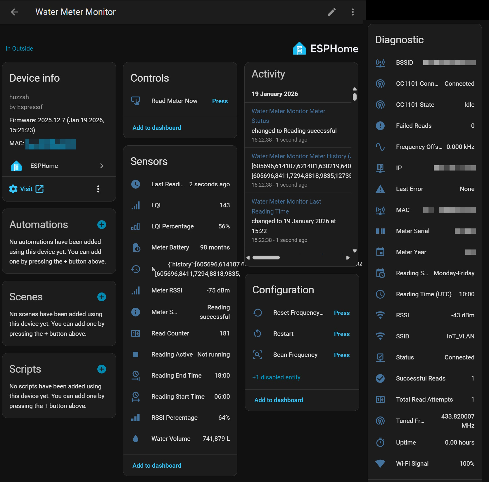

# EverBlu Meter — ESPHome External Component

[![Contributors][contributors-shield]][contributors-url]
[![Forks][forks-shield]][forks-url]
[![Stargazers][stars-shield]][stars-url]
[![Issues][issues-shield]][issues-url]
[![MIT License][license-shield]][license-url]

Native ESPHome integration for reading EverBlu Cyble Enhanced water & gas meters — no MQTT broker required.

- [Explore the docs](docs/ESPHOME_INTEGRATION_GUIDE.md)
- [View Examples](example-water-meter.yaml)
- [Report Bug](https://github.com/genestealer/everblu-meters-esp8266-improved/issues/new?labels=bug)
- [Request Feature](https://github.com/genestealer/everblu-meters-esp8266-improved/issues/new?labels=enhancement)

<!-- START doctoc generated TOC please keep comment here to allow auto update -->
<!-- DON'T EDIT THIS SECTION, INSTEAD RE-RUN doctoc TO UPDATE -->
**Table of Contents**

- [About The Project](#about-the-project)
  - [Built With](#built-with)
- [Getting Started](#getting-started)
  - [Prerequisites](#prerequisites)
  - [Installation](#installation)
- [Usage](#usage)
- [Roadmap](#roadmap)
- [Contributing](#contributing)
- [License](#license)
- [Contact](#contact)
- [Acknowledgments](#acknowledgments)

<!-- END doctoc generated TOC please keep comment here to allow auto update -->

## About The Project



This is the **ESPHome external component** for the
[EverBlu Meters](../README.md) project. It reads EverBlu Cyble Enhanced water and gas
meters (RADIAN protocol, 433 MHz) with an ESP8266/ESP32 + CC1101 and integrates
directly with Home Assistant via the ESPHome API — no MQTT broker needed.

It shares the same core radio/protocol code as the standalone MQTT firmware, wrapped in
an ESPHome `Component`/`Sensor` hierarchy via a clean adapter pattern:

```text
EverbluMeterComponent (ESPHome)
├── ESPHomeConfigProvider    → Configuration from YAML
├── ESPHomeTimeProvider      → Time synchronization
├── ESPHomeDataPublisher     → Sensor publishing
└── MeterReader (shared)
    ├── CC1101 · FrequencyManager · ScheduleManager
```

> [!WARNING]
> **Breaking change (v3.0.0+):** GDO2 is required by default. Wire CC1101 GDO2 to a free
> GPIO and set `gdo2_pin:`, or opt out with `disable_gdo2_fifo_management: true`.

### Built With

[![ESPHome][ESPHome-badge]][ESPHome-url]
[![Home Assistant][HA-badge]][HA-url]
[![ESP8266][ESP8266-badge]][ESP8266-url]
[![ESP32][ESP32-badge]][ESP32-url]

Build with the **Arduino** framework (`esp32.framework.type: arduino`). ESP-IDF is not supported.

## Getting Started

### Prerequisites

- An **ESP8266** (e.g. D1 Mini) or **ESP32** board.
- A **CC1101** RF transceiver module (**3.3V only**).
- An **EverBlu Cyble Enhanced** meter with RF module.
- A working [ESPHome](https://esphome.io/) install (Device Builder or CLI).

Wiring (see the [Integration Guide](docs/ESPHOME_INTEGRATION_GUIDE.md) for full details):

| CC1101 | Function     | ESP8266 (D1 Mini) | ESP32  |
| ------ | ------------ | ----------------- | ------ |
| VCC    | Power (3.3V) | 3.3V              | 3.3V   |
| GND    | Ground       | GND               | GND    |
| SCK    | SPI Clock    | D5 (GPIO14)       | GPIO18 |
| MISO   | SPI Data In  | D6 (GPIO12)       | GPIO19 |
| MOSI   | SPI Data Out | D7 (GPIO13)       | GPIO23 |
| CSN    | Chip Select  | D8 (GPIO15)       | GPIO25 |
| GDO0   | Data Ready   | D1 (GPIO5)        | GPIO4  |
| GDO2   | FIFO (req.)  | D2 (GPIO4)        | GPIO27 |

### Installation

Add the external component and a matching `spi:` bus to your ESPHome YAML:

```yaml
external_components:
  - source:
      type: git
      url: https://github.com/genestealer/everblu-meters-esp8266-improved
      ref: main
      path: ESPHOME-release
    components: [ everblu_meter ]
    refresh: 1d

time:
  - platform: homeassistant
    id: ha_time

spi:
  id: main_bus
  clk_pin: GPIO14
  mosi_pin: GPIO13
  miso_pin: GPIO12

everblu_meter:
  spi_id: main_bus
  cs_pin: GPIO15
  meter_code: "21-1234567-000"
  meter_type: water
  gdo0_pin: 4
  gdo2_pin: 4
  time_id: ha_time
  volume:
    name: "Water Volume"
  status:
    name: "Status"
```

Then build and upload:

```sh
esphome run your-config.yaml
```

## Usage

Sensors are auto-discovered in Home Assistant once the device connects. The component
exposes volume, battery, RSSI/LQI, timing, frequency diagnostics, status/error text
sensors, control buttons (manual read, deep scan, reset frequency), and a
`history_json` sensor with 12 months of on-meter history.

Common key parameters:

| Parameter            | Default       | Description                                          |
| -------------------- | ------------- | ---------------------------------------------------- |
| `meter_code`         | —             | Dashed meter code `YY-SSSSSSS[-NNN]` (required)      |
| `meter_type`         | `water`       | `water` or `gas`                                     |
| `gdo2_pin`           | —             | Required unless `disable_gdo2_fifo_management: true` |
| `frequency`          | `433.82`      | RF frequency (MHz)                                   |
| `reading_schedule`   | Monday-Friday | Days to read (preset or single day)                  |
| `timezone_offset`    | `0`           | Minutes from UTC (no DST auto-adjust)                |
| `gas_volume_divisor` | `100`         | Gas divisor (100 or 1000)                            |
| `debug_cc1101`       | `false`       | Enable hex dump for troubleshooting                  |

Ready-made examples:
[water](example-water-meter.yaml) ·
[gas](example-gas-meter-minimal.yaml) ·
[advanced](example-advanced.yaml) ·
[multi-meter](example-multi-meter.yaml) ·
[Nano ESP32](example-nano-esp32.yaml).

For the full parameter reference, sensor list, and troubleshooting, see the
[Integration Guide](docs/ESPHOME_INTEGRATION_GUIDE.md) and
[Home Assistant Integration](docs/ESPHOME_HOME_ASSISTANT_INTEGRATION.md).

## Roadmap

- [x] Native ESPHome API integration (no MQTT broker)
- [x] Automatic sensor discovery
- [x] Water and gas meter support
- [x] Frequency scanning and drift recovery
- [x] Hardware FIFO management via GDO2
- [x] 12-month on-meter history JSON sensor

See the [open issues](https://github.com/genestealer/everblu-meters-esp8266-improved/issues)
for proposed features and known issues.

## Contributing

Contributions are **greatly appreciated**. The C++ sources follow ESPHome's own coding
standards; run the formatter before committing:

```sh
ESPHOME/format-component.sh --fix        # Linux / macOS
./ESPHOME/format-component.ps1 -Fix      # Windows / PowerShell
```

Repo-wide linting runs through [pre-commit](https://pre-commit.com) (ruff, yamllint,
clang-format). See [../CONTRIBUTING.md](../CONTRIBUTING.md) and
[docs/DEVELOPER_GUIDE.md](docs/DEVELOPER_GUIDE.md).

> **Note:** `ESPHOME-release/` is generated output. Never edit it directly — make changes
> in `ESPHOME/components/everblu_meter/` and regenerate via `prepare-component-release`.

1. Fork the Project
2. Create your Feature Branch (`git checkout -b feature/AmazingFeature`)
3. Commit your Changes (`git commit -m 'Add some AmazingFeature'`)
4. Push to the Branch (`git push origin feature/AmazingFeature`)
5. Open a Pull Request

## License

Distributed under the MIT License. See [../LICENSE.md](../LICENSE.md) for more information.

## Contact

genestealer - [@genestealer](https://github.com/genestealer)

Project Link: [https://github.com/genestealer/everblu-meters-esp8266-improved](https://github.com/genestealer/everblu-meters-esp8266-improved)

## Acknowledgments

- [Main project README](../README.md)
- [ESPHome](https://esphome.io/)
- [Home Assistant](https://www.home-assistant.io/)
- [ESPHome AI Collaboration Guide](https://github.com/esphome/esphome/blob/dev/AGENTS.md)
- [Best-README-Template](https://github.com/othneildrew/Best-README-Template)

<!-- MARKDOWN LINKS & IMAGES -->
[contributors-shield]: https://img.shields.io/github/contributors/genestealer/everblu-meters-esp8266-improved.svg?style=for-the-badge
[contributors-url]: https://github.com/genestealer/everblu-meters-esp8266-improved/graphs/contributors
[forks-shield]: https://img.shields.io/github/forks/genestealer/everblu-meters-esp8266-improved.svg?style=for-the-badge
[forks-url]: https://github.com/genestealer/everblu-meters-esp8266-improved/network/members
[stars-shield]: https://img.shields.io/github/stars/genestealer/everblu-meters-esp8266-improved.svg?style=for-the-badge
[stars-url]: https://github.com/genestealer/everblu-meters-esp8266-improved/stargazers
[issues-shield]: https://img.shields.io/github/issues/genestealer/everblu-meters-esp8266-improved.svg?style=for-the-badge
[issues-url]: https://github.com/genestealer/everblu-meters-esp8266-improved/issues
[license-shield]: https://img.shields.io/github/license/genestealer/everblu-meters-esp8266-improved.svg?style=for-the-badge
[license-url]: https://github.com/genestealer/everblu-meters-esp8266-improved/blob/main/LICENSE.md

[ESPHome-badge]: https://img.shields.io/badge/ESPHome-Compatible-brightgreen?style=for-the-badge&logo=esphome&logoColor=white
[ESPHome-url]: https://esphome.io
[HA-badge]: https://img.shields.io/badge/Home%20Assistant-41BDF5?style=for-the-badge&logo=homeassistant&logoColor=white
[HA-url]: https://www.home-assistant.io
[ESP8266-badge]: https://img.shields.io/badge/ESP-8266-blue?style=for-the-badge&logo=espressif&logoColor=white
[ESP8266-url]: https://www.espressif.com/en/products/socs/esp8266
[ESP32-badge]: https://img.shields.io/badge/ESP-32-blue?style=for-the-badge&logo=espressif&logoColor=white
[ESP32-url]: https://www.espressif.com/en/products/socs/esp32
