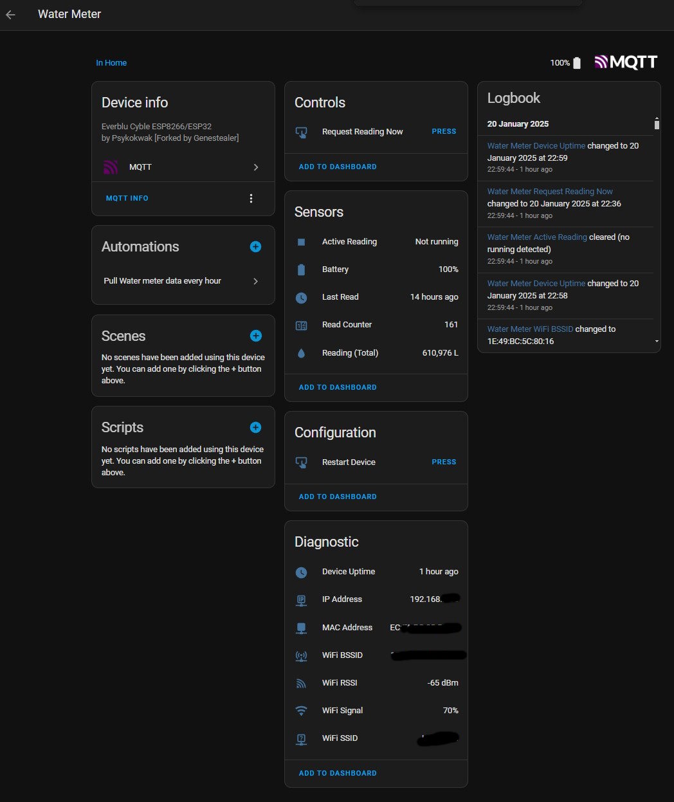

# everblu-meters-esp8266/esp32 - Water Usage Data for Home Assistant

Fetch water or gas usage data from Itron EverBlu Cyble Enhanced RF water meters using the RADIAN protocol (Sontex, Itron) on 433 MHz with an ESP32/ESP8266 and CC1101 transceiver. Integrated with Home Assistant via MQTT AutoDiscovery.

According to the radio communication approval paperwork, this may also work with the following models, though they are untested:
- AnyQuest Cyble Enhanced
- EverBlu Cyble
- AnyQuest Cyble Basic

The original software (and much of the foundational work) was initially developed [here](http://www.lamaisonsimon.fr/wiki/doku.php?id=maison2:compteur_d_eau:compteur_d_eau), later published on GitHub by @neutrinus [here](https://github.com/neutrinus/everblu-meters), and subsequently forked by [psykokwak](https://github.com/psykokwak-com/everblu-meters-esp8266).

Supported meters:

- [Itron EverBlu Cyble Enhanced](https://multipartirtaanugra.com/wp-content/uploads/2020/09/09.-Cyble-RF.pdf)

## Hardware

The project runs on ESP8266/ESP32 with an RF transceiver (CC1101). The hardware can be any ESP32+CC1101 with the correct wiring.

### Connections (ESP32/ESP8266 to CC1101)

- Refer to `cc1101.ccp` for SPI pin mappings.
- Refer to `everblu_meters.h` for GDOx pin mappings.

Pin wiring for the [Wemos D1 board](https://www.wemos.cc/en/latest/d1/index.html) and [Adafruit Feather HUZZAH ESP8266](https://learn.adafruit.com/adafruit-feather-huzzah-esp8266/pinouts):

| **CC1101**  | **Wemos** | **HUZZAH ESP8266** | **Notes**                                      |
|-------------|-----------|--------------------|------------------------------------------------|
| VCC         | 3V3       | 3V                 | Connect to the 3.3V power pin.                |
| GDO0        | D1        | GPIO5              | General-purpose digital output.               |
| CSN         | D8        | GPIO15             | SPI chip select; Feather uses GPIO15 as CS.   |
| SCK         | D5        | GPIO14             | SPI clock pin; SPI SCK maps to GPIO14.        |
| MOSI        | D7        | GPIO13             | SPI MOSI pin; maps to GPIO13 on the Feather.  |
| GDO1 (MISO) | D6        | GPIO12             | SPI MISO pin; maps to GPIO12 on the Feather.  |
| GDO2        | D2        | GPIO4              | Another general-purpose digital output.       |
| GND         | G         | GND                | Connect to ground.                            |

### CC1101
l
Some modules are not labeled on the PCB. Below is the pinout for one:

## Configuration

1. **Install Required Tools**  
  - Download and install [Visual Studio Code](https://code.visualstudio.com/).  
  - Install the [PlatformIO extension for VS Code](https://platformio.org/). This will install all required dependencies and may require restarting VS Code.

2. **Prepare Configuration Files**  
  - Copy `Exampleprivate.h` into the `src` folder and rename it to `private.h`.  
  - Update the following details in `private.h`:
    - Wi-Fi and MQTT credentials. If your MQTT setup does not require a username and password, comment out those lines using `//`.  
    - Meter serial number (omit the leading 0) and production year. This information is printed on the meter label:  
      

3. **Update Platform Configuration**  
  - Modify the `platformio.ini` file to match your specific platform and board configuration.

4. **Perform Frequency Discovery (First-Time Setup)**  
  - Open `private.h` and set `SCAN_FREQUENCY_433MHZ` to `1` to enable frequency discovery.  
  - Compile and upload the code to your ESP device using PlatformIO. Use **PlatformIO > Upload and Monitor**.  
  - Keep the device connected to your computer during this process. The serial monitor will display debug output as the device scans frequencies in the 433 MHz range.  
  - Once the correct frequency is identified, update the `FREQUENCY` value in `private.h`.  
  - Disable frequency discovery by setting `SCAN_FREQUENCY_433MHZ` back to `0` in `private.h`.  
  - For best results, perform this step during local business hours. Refer to the "Frequency Adjustment" section below for additional guidance.

5. **Compile and Flash the Code**  
  - Compile and upload the code to your ESP device using **PlatformIO > Upload and Monitor**.  
  - Keep the device connected to your computer during this process.

6. **Verify Meter Data**  
  - After a few seconds, the meter data should appear in the terminal (bottom panel) and be pushed to MQTT.  
  - If Frequency Discovery is still enabled, its output will also be displayed during this step.

7. **Automatic Meter Query**  
  - The device will automatically query the meter once every 24 hours. If the query fails, it will retry every hour until successful.

## Troubleshooting

### Frequency Adjustment

Your transceiver module may not be calibrated correctly. Adjust the frequency slightly lower or higher and try again. You may use an RTL-SDR to measure the required offset and rerun the Frequency Discovery code.

### Business Hours

> [!TIP]
> Your meter may be configured to listen for requests only during business hours to conserve energy. If you are unable to communicate with the meter, try again during business hours (8:00–16:00), Monday to Friday. As a rule of thumb, set up your device during business hours to avoid confusion and unnecessary troubleshooting.

> [!NOTE]
> This is particularly relevant in the UK.

### Serial Number Starting with 0

Ignore the leading 0 and provide the serial number in the configuration without it.

### Distance Between Device and Meter

Typically, a CC1101 433 MHz module with an external wire coil antenna has a maximum range of 300–500 m. SMA CC1101 boards with high-gain antennas may increase or even double this range. However, be mindful of the distance for effective use.
c
## Origin and License
ccod
This code is based on work from [La Maison Simon](http://www.lamaisonsimon.fr/wiki/doku.php?id=maison2:compteur_d_eau:compteur_d_eau).
c
The license is unknown. According to one of the authors (Fred):
c
> I didn't put a license on this code; maybe I should. I didn't know much about licensing at the time.
> This code was created by "looking" at the RADIAN protocol, which is said to be open source earlier in the page. I don't know if that helps.
