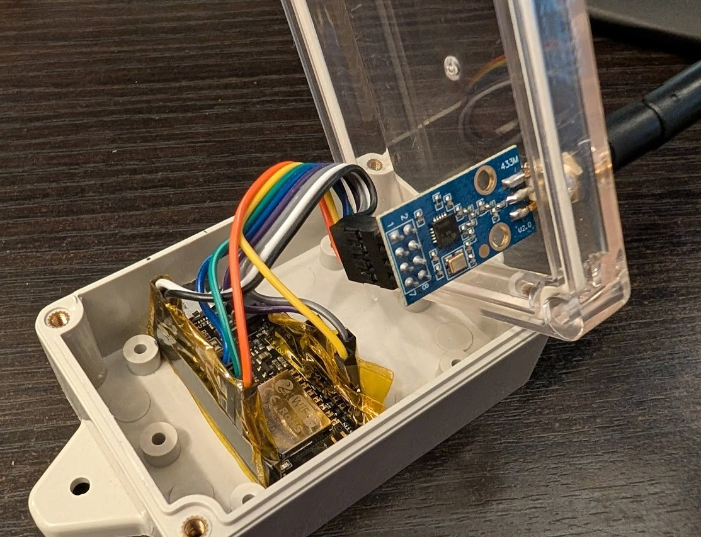
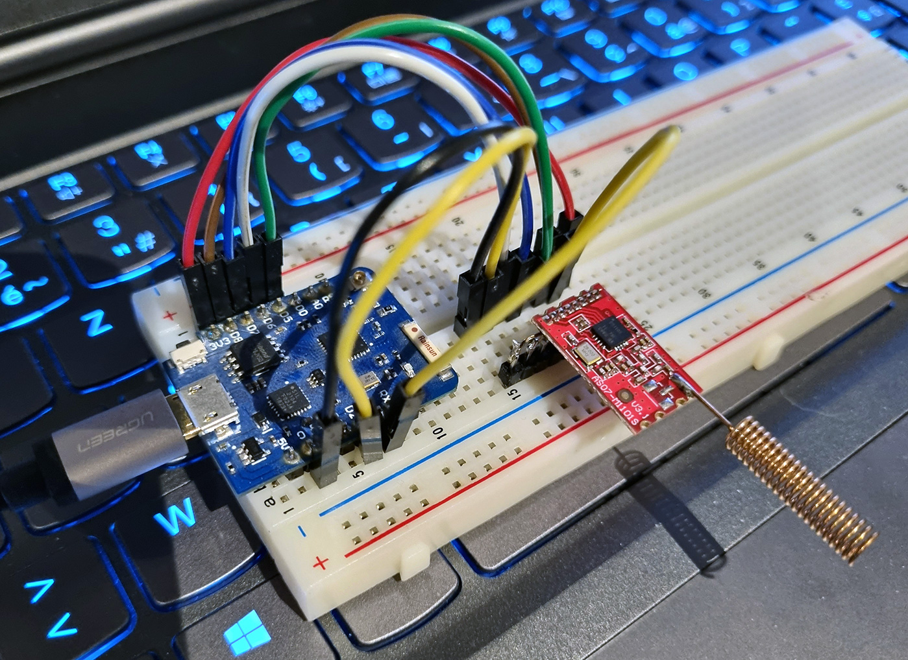
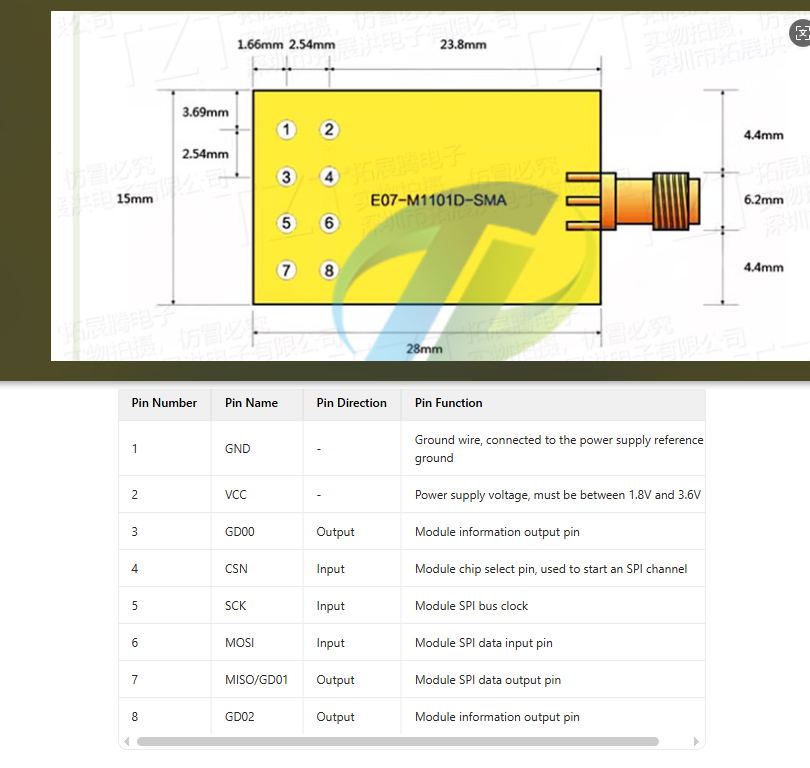
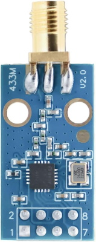
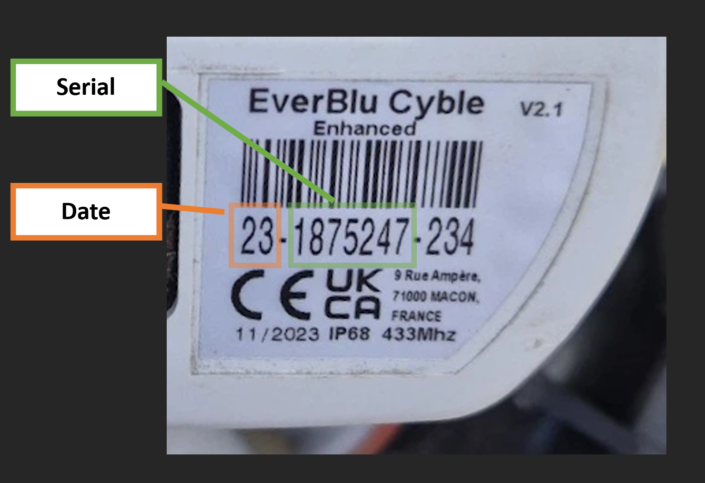
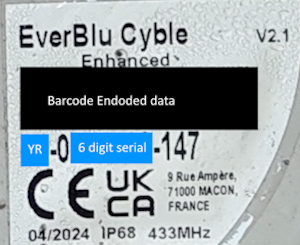

# everblu-meters-esp8266/esp32 - Itron EverBlu Cyble Enhanced RF RADIAN Water Usage Data for Home Assistant

[](https://github.com/genestealer/everblu-meters-esp8266-improved/actions/workflows/build-esp8266.yml)
[](https://github.com/genestealer/everblu-meters-esp8266-improved/actions/workflows/build-esp32.yml)

Fetch water or gas usage data from Itron EverBlu Cyble Enhanced RF water meters using the RADIAN protocol (Sontex, Itron) on 433 MHz with an ESP32/ESP8266 and CC1101 transceiver. Integrated with Home Assistant via MQTT AutoDiscovery.

According to the radio communication approval paperwork, this may also work with the following models, though they are untested:

- AnyQuest Cyble Enhanced
- EverBlu Cyble
- AnyQuest Cyble Basic


The original software (and much of the foundational work) was initially developed [here](http://www.lamaisonsimon.fr/wiki/doku.php?id=maison2:compteur_d_eau:compteur_d_eau), later published on GitHub by @neutrinus [here](https://github.com/neutrinus/everblu-meters), and subsequently forked by [psykokwak](https://github.com/psykokwak-com/everblu-meters-esp8266).

Supported meters:

- [Itron EverBlu Cyble Enhanced](https://multipartirtaanugra.com/wp-content/uploads/2020/09/09.-Cyble-RF.pdf)


## Features

- Fetch water or gas usage data from Itron EverBlu Cyble Enhanced RF water meters.
- Includes RSSI (Radio Signal Strength Indicator), LQI (Link Quality) and Signal Strength for the meter for diagnostics.
- Time Start and Time End sensors to indicate when the meter wakes and sleeps.
- MQTT integration for Home Assistant with AutoDiscovery.
- Automatic CC1101 frequency calibration with manual fallback.
- Wi-Fi diagnostics and OTA updates.
- Reading Schedule Configuration: Configure the days when the meter should be queried (e.g., Monday-Friday, Monday-Saturday, or Monday-Sunday).
- Daily scheduled meter readings.

---

### Credits

This project builds on reverse engineering efforts by:

- La Maison Simon (http://www.lamaisonsimon.fr/)
- @neutrinus and @psykokwak on GitHub

Their original projects did not include an open-source license. If you reuse or modify their specific code portions, please review their repositories and respect any stated limitations or intentions.

---

## Hardware

The project runs on ESP8266/ESP32 with an RF transceiver (CC1101). The hardware can be any ESP32+CC1101 with the correct wiring.



### Connections (ESP32/ESP8266 to CC1101)

The project uses the ESP8266/ESP32's **hardware SPI pins** to communicate with the CC1101 radio module. Below are the wiring diagrams for common ESP8266 boards and ESP32 DevKit.

#### Pin Mapping Reference

**For ESP8266 (All Boards):**
- **SCK (SPI Clock)**: GPIO 14
- **MISO (Master In Slave Out)**: GPIO 12
- **MOSI (Master Out Slave In)**: GPIO 13
- **CS/SS (Chip Select)**: GPIO 15
- **GDO0 (CC1101 Data Ready)**: GPIO 5 (configurable in `config.h`)

#### Wiring Table

Pin wiring for the [Wemos D1 Mini](https://www.wemos.cc/en/latest/d1/index.html), [Adafruit Feather HUZZAH ESP8266](https://learn.adafruit.com/adafruit-feather-huzzah-esp8266/pinouts), and ESP32 DevKit:

| **CC1101 Pin** | **Function** | **ESP8266 GPIO** | **Wemos D1 Mini** | **HUZZAH ESP8266** | **ESP32 GPIO** | **ESP32 DevKit** | **Notes** |
|----------------|--------------|------------------|-------------------|--------------------|----------------|------------------|-----------|
| **VCC**        | Power        | 3.3V             | 3V3               | 3V                 | 3.3V           | 3V3              | **Important:** Use 3.3V only! |
| **GND**        | Ground       | GND              | G                 | GND                | GND            | GND              | Common ground |
| **SCK**        | SPI Clock    | GPIO 14          | D5                | #14                | GPIO 18        | SCK              | Hardware SPI clock |
| **MISO**       | SPI Data In  | GPIO 12          | D6                | #12                | GPIO 19        | MISO             | Also labeled as GDO1 on some CC1101 modules |
| **MOSI**       | SPI Data Out | GPIO 13          | D7                | #13                | GPIO 23        | MOSI             | Hardware SPI MOSI |
| **CSN/CS**     | Chip Select  | GPIO 15          | D8                | #15                | GPIO 5         | SS               | SPI chip select |
| **GDO0**       | Data Ready   | GPIO 5           | D1                | #5                 | GPIO 4         | GPIO 4           | Digital interrupt pin (configurable in `config.h`) |
| **GDO2**       | Not used     | -                | -                 | -                  | -              | -                | Leave disconnected (optional) |

#### Important Notes

- **Voltage:** The CC1101 operates at **3.3V only**. Do not connect to 5V or you will damage the module.
- **Hardware SPI:** This project uses the ESP8266/ESP32's hardware SPI interface for reliable, high-speed communication.
- **GDO0 Pin:** Default is GPIO 5 for ESP8266, GPIO 4 for ESP32. You can change this in your `config.h` file if needed.
- **Wemos D1 Mini Labels:** The Wemos board uses "D" labels (D1, D5, D6, etc.) which correspond to specific GPIO numbers. See the table above for the mapping.
- **HUZZAH Pinout:** The Adafruit HUZZAH uses GPIO numbers directly on the silkscreen (no "D" labels). The table shows the corresponding GPIO numbers.
- **ESP32 DevKit:** Most ESP32 DevKit boards use standard hardware SPI pins (SCK=18, MISO=19, MOSI=23, CS=5). The silkscreen typically labels these with their function names.

#### Quick Reference: Wemos D1 Mini

```text
CC1101 → Wemos D1 Mini
VCC    → 3V3
GND    → G
SCK    → D5 (GPIO 14)
MISO   → D6 (GPIO 12)
MOSI   → D7 (GPIO 13)
CSN    → D8 (GPIO 15)
GDO0   → D1 (GPIO 5)
```

#### Quick Reference: Adafruit Feather HUZZAH ESP8266

```text
CC1101 → HUZZAH ESP8266
VCC    → 3V
GND    → GND
SCK    → #14 (GPIO 14)
MISO   → #12 (GPIO 12)
MOSI   → #13 (GPIO 13)
CSN    → #15 (GPIO 15)
GDO0   → #5  (GPIO 5)
```

#### Quick Reference: ESP32 DevKit (esp32dev)

```text
CC1101 → ESP32 DevKit
VCC    → 3V3
GND    → GND
SCK    → SCK (GPIO 18 on most DevKit boards)
MISO   → MISO (GPIO 19)
MOSI   → MOSI (GPIO 23)
CSN    → SS (GPIO 5 by default on many boards)
GDO0   → GPIO 4 (or GPIO 27)  ← set this in include/config.h as GDO0
```

Notes for ESP32
- Use the board’s hardware SPI pins (SCK/MISO/MOSI/SS). The defaults are provided by the Arduino core and used automatically by this project.
- Choose a free GPIO for GDO0 (e.g., 4 or 27) and set `#define GDO0 <pin>` in `include/config.h`.
- Power the CC1101 from 3.3V only.

#### Adafruit Feather HUZZAH Silkscreen Labels

To make wiring dead-simple on the HUZZAH, here’s the exact silkscreen text next to each pin we use and what it connects to on the CC1101:

- Power
  - Board label: "3V" → CC1101 VCC (3.3V only)
  - Board label: "GND" → CC1101 GND

- SPI signals
  - Board label: "SCK / #14" → CC1101 SCK (SPI Clock)
  - Board label: "MISO / #12" → CC1101 MISO
  - Board label: "MOSI / #13" → CC1101 MOSI
  - Board label: "SS / #15"   → CC1101 CSN (Chip Select)

- CC1101 interrupt (data ready)
  - Board label: "#5" → CC1101 GDO0  (default; configurable via `config.h`)

Notes
- On the HUZZAH, many pins show both the function and the GPIO number, e.g. "SCK / #14". You can use either reference when wiring.
- Only use the 3V (3.3V) pin to power the CC1101. Do not use 5V.

#### HUZZAH Boot-Strap Pins and Red LED (GPIO #0)

On the Adafruit Feather HUZZAH ESP8266, **GPIO #0 has a red LED attached and is also a boot-strap pin** used to enter the ROM bootloader. Important implications:

- If GPIO #0 is held LOW during reset/power-up, the ESP8266 will enter the bootloader instead of running your sketch.
- The red LED on GPIO #0 is wired “reverse”: writing LOW turns the LED ON, writing HIGH turns it OFF.
- GPIO #0 does not have an internal pull-up by default.

Because of the above, **do not use GPIO #0 for CC1101 GDO0**. This project defaults to using **GPIO #5** for GDO0 on HUZZAH, which is safe and avoids accidental bootloader entry. You can still use GPIO #0 for simple LED indication in your own code, but avoid wiring CC1101 signals to it.

Also note other ESP8266 boot-strap pins on HUZZAH:
- GPIO #15 (used here as CS/SS) must be LOW at boot (the HUZZAH board provides the correct pull-down). Don’t force it HIGH during reset.
- GPIO #2 should normally be HIGH at boot (not used by this project).

### CC1101

Some modules are not labeled on the PCB. Below is the pinout for one:



---

## MQTT Integration

The following MQTT topics are used to integrate the device with Home Assistant via AutoDiscovery:

| **Sensor**          | **MQTT Topic**                  | **Description**                                                                |
|---------------------|---------------------------------|--------------------------------------------------------------------------------|
| `Liters`            | `everblu/cyble/liters`          | Total water usage in liters.                                                   |
| `Battery`           | `everblu/cyble/battery`         | Remaining battery life in months.                                              |
| `Counter`           | `everblu/cyble/counter`         | Number of times the meter has been read (wraps around 255→1).                  |
| `RSSI`              | `everblu/cyble/rssi`            | Raw RSSI value of the meter's signal.                                          |
| `RSSI (dBm)`        | `everblu/cyble/rssi_dbm`        | RSSI value converted to dBm.                                                   |
| `RSSI (%)`          | `everblu/cyble/rssi_percentage` | RSSI value converted to a percentage.                                          |
| `Time Start`        | `everblu/cyble/time_start`      | Time when the meter wakes up, formatted as `HH:MM`.                            |
| `Time End`          | `everblu/cyble/time_end`        | Time when the meter goes to sleep, formatted as `HH:MM`.                       |
| `Timestamp`         | `everblu/cyble/timestamp`       | ISO 8601 timestamp of the last reading.                                        |
| `Wi-Fi IP`          | `everblu/cyble/wifi_ip`         | IP address of the device.                                                      |
| `Wi-Fi RSSI`        | `everblu/cyble/wifi_rssi`       | Wi-Fi signal strength in dBm.                                                  |
| `Wi-Fi Signal (%)`  | `everblu/cyble/wifi_signal_percentage` | Wi-Fi signal strength as a percentage.                                  |
| `MAC Address`       | `everblu/cyble/mac_address`     | MAC address of the device.                                                     |
| `SSID`              | `everblu/cyble/ssid`            | Wi-Fi SSID the device is connected to.                                         |
| `BSSID`             | `everblu/cyble/bssid`           | Wi-Fi BSSID the device is connected to.                                        |
| `Uptime`            | `everblu/cyble/uptime`          | Device uptime in ISO 8601 format.                                              |

---

## Configuration

### Continuous Integration

This project uses GitHub Actions for automated building and testing. Every push and pull request triggers builds for both ESP8266 (huzzah) and ESP32 (esp32dev) environments to ensure code quality and compatibility.

The CI workflow:
- Builds the project for both ESP8266 and ESP32 platforms
- Validates that the code compiles successfully
- Caches dependencies for faster builds
- Uploads firmware artifacts for successful builds

You can view the build status at the top of this README or in the [Actions tab](https://github.com/genestealer/everblu-meters-esp8266-improved/actions).

### Local Development Setup

1. **Install Required Tools**  
  - Download and install [Visual Studio Code](https://code.visualstudio.com/).  
  - Install the [PlatformIO extension for VS Code](https://platformio.org/). This will install all required dependencies and may require restarting VS Code.

2. **Prepare Configuration Files**  
  - Copy `include/config.example.h` to `include/config.h`.  
  - Update the following details in `config.h`:
    - Wi-Fi and MQTT credentials. If your MQTT setup does not require a username and password, comment out those lines using `//`.  
    - Meter serial number (omit the leading 0) and production year. This information is printed on the meter label:  
      
    - **Wi-Fi PHY Mode**: To enable 802.11g Wi-Fi PHY mode, set `ENABLE_WIFI_PHY_MODE_11G` to `1` in the `config.h` file. By default, it is set to `0` (disabled).

3. **Update Platform Configuration**  
  - Select an environment in `platformio.ini`:
    - `env:huzzah` (ESP8266 Adafruit HUZZAH)
    - `env:esp32dev` (ESP32 DevKit)
  - Example: build ESP8266 HUZZAH
    - In VS Code, choose the `huzzah` environment and run “Build” or “Upload and Monitor”.
  - Example: build ESP32 DevKit
    - In VS Code, choose the `esp32dev` environment and run “Build” or “Upload and Monitor”.
  - OTA upload is configured only under `env:huzzah` by default. For ESP32, use serial upload unless you add OTA settings for your device’s IP.

4. **Perform Frequency Discovery (First-Time Setup)**  
  - Open `config.h` and set `SCAN_FREQUENCY_433MHZ` to `1` to enable frequency discovery.  
  - Compile and upload the code to your ESP device using PlatformIO. Use **PlatformIO > Upload and Monitor**.  
  - **Keep the device connected to your computer during this process.** The serial monitor will display debug output as the device scans frequencies in the 433 MHz range.  
  - **Important**: During the initial scan (first boot with no stored frequency offset), the device performs a wide frequency scan that takes approximately 2 minutes **before** connecting to MQTT. You will see no MQTT/Home Assistant activity during this time - this is normal. Monitor the serial output to see the scan progress. Once the scan completes and the optimal frequency is found, the device will connect to MQTT and publish telemetry data.
  - Once the correct frequency is identified, update the `FREQUENCY` value in `config.h` if needed (the automatic scan stores the offset, so manual adjustment is usually not required).  
  - Disable frequency discovery by setting `SCAN_FREQUENCY_433MHZ` back to `0` in `config.h` if you want to skip the initial scan on future reboots.  
  - For best results, perform this step during local business hours when the meter is most likely to transmit. Refer to the "Frequency Adjustment" section below for additional guidance.

5. **Compile and Flash the Code**  
  - Compile and upload the code to your ESP device using **PlatformIO > Upload and Monitor**.  
  - Keep the device connected to your computer during this process.

6. **Verify Meter Data**  
  - After WiFi and MQTT connection is established (or after the initial frequency scan completes), the meter data should appear in the terminal (bottom panel) and be pushed to MQTT.  
  - If Frequency Discovery is still enabled, its output will also be displayed during this step.
  - **Note**: On first boot with no stored frequency offset, there will be a ~2 minute delay before any MQTT activity while the wide frequency scan runs. This is normal - monitor the serial output to see progress.

7. **Automatic Meter Query**  
  - The device will automatically query the meter once every 24 hours. If the query fails, it will retry every hour until successful.

---

### Reading Schedule

The **Reading Schedule** feature allows you to configure the days when the meter should be queried. By default, the schedule is set to `Monday-Friday`. You can change this in the `config.h` file by modifying the `DEFAULT_READING_SCHEDULE`.

Available options:
- `"Monday-Friday"`: Queries the meter only on weekdays.
- `"Monday-Saturday"`: Queries the meter from Monday to Saturday.
- `"Monday-Sunday"`: Queries the meter every day.

Example configuration in `config.h`:
```cpp
#define DEFAULT_READING_SCHEDULE "Monday-Saturday"
```

---

### Frequency Configuration

The firmware uses **automatic frequency calibration** on the CC1101 radio to ensure accurate communication with your meter. The frequency is configured at compile time in your `config.h` file.

#### How It Works

1. **Compile-Time Configuration**: The operating frequency is set via the `FREQUENCY` define in `config.h` (e.g., `#define FREQUENCY 433.82`).

2. **Default Frequency**: If you don't specify `FREQUENCY` in your config file, the firmware will automatically default to **433.82 MHz**, which is the standard RADIAN protocol center frequency for EverBlu meters. A warning will be logged at startup if the default is used.

3. **Automatic Calibration**: The CC1101 radio performs automatic frequency synthesizer calibration on every idle-to-RX/TX transition (via the `FS_AUTOCAL` setting in `MCSM0`). Additionally, the firmware triggers a manual calibration (`SCAL` strobe) immediately after setting the frequency during initialization.

4. **Frequency Offset Compensation**: The CC1101's built-in frequency offset compensation (FOC) is enabled to automatically correct for small frequency drift during reception.

5. **No MQTT Publishing**: The frequency is **not published to MQTT or Home Assistant**. It's a low-level radio configuration parameter that:
   - Doesn't change during runtime
   - Is already visible in the serial debug log at startup
   - Isn't meaningful as a "sensor" value in Home Assistant
   - Would only add unnecessary clutter to your HA dashboard

#### Why This Approach?

Previous versions required manual frequency scanning and static calibration values. The new approach:
- **Simplifies setup**: Just set your frequency once in `config.h` (or use the default)
- **Improves accuracy**: Automatic calibration adapts to temperature and voltage variations
- **Reduces maintenance**: No need to manually determine and set `FSCAL` values
- **Enhances reliability**: FOC compensates for small frequency errors during reception

#### Configuration Example

In your `config.h`:
```cpp
// Optional: Specify the meter's frequency in MHz
// If not defined, defaults to 433.82 MHz (RADIAN protocol standard)
#define FREQUENCY 433.82
```

To find your meter's exact frequency, you can:
1. Use the frequency scanning mode (set `SCAN_FREQUENCY_433MHZ` to `1`) during initial setup
2. Use an RTL-SDR to measure the frequency while a utility reader is polling your meter
3. Start with the default 433.82 MHz and adjust slightly if needed (typically ±0.01 MHz)

The effective frequency is always displayed in the serial log during startup:
```
> Frequency (effective): 433.820000 MHz
```

---

### Adaptive Frequency Management

The firmware includes **automatic frequency adaptation** features to work reliably with any CC1101 module:

1. **Wide Initial Scan (First Boot)**: On first boot (when no frequency offset is stored), the firmware automatically scans ±100 kHz around the base frequency to find your meter. This takes ~1-2 minutes.

2. **Adaptive Frequency Tracking**: After each successful meter read, the firmware monitors the CC1101's FREQEST register and accumulates frequency error. After 10 successful reads, if the average error exceeds 2 kHz, it automatically adjusts the stored frequency offset to compensate for CC1101 crystal drift.

3. **Enhanced FOC**: The CC1101's Frequency Offset Compensation is configured for optimal performance with the EverBlu meter protocol.

#### When to Clear EEPROM

**Always clear EEPROM when you change hardware:**

- **Replace ESP8266/ESP32 board** - Different boards may have slightly different characteristics
- **Replace CC1101 radio module** - Each CC1101 has unique crystal tolerance (typically ±10-50 kHz)
- **Move to a different meter** - Different meters may transmit on slightly different frequencies

**How to clear EEPROM:**

In `include/config.h`, temporarily set:
```cpp
#define CLEAR_EEPROM_ON_BOOT 1
```

Upload firmware and wait for one boot cycle (wide scan will run automatically). Then set back to:
```cpp
#define CLEAR_EEPROM_ON_BOOT 0
```

Upload again to preserve the discovered frequency.

**Why this matters:** The stored frequency offset is specific to your CC1101 module. Using a different CC1101 with the old offset may prevent successful meter communication. Clearing EEPROM forces the firmware to rediscover the optimal frequency for your new hardware.

See `ADAPTIVE_FREQUENCY_FEATURES.md` for detailed technical documentation.

---

## Troubleshooting
### ESP32 build: ModuleNotFoundError: No module named 'intelhex'

This is a PlatformIO tooling dependency used by `esptool.py` to build ESP32 bootloader/partition images. It is not a project file and isn’t committed to the repo. PlatformIO usually manages it automatically, but on some Windows setups it can be missing.

Try the following in order:

- Upgrade PlatformIO core and the Espressif32 platform (from PlatformIO Home → Platforms → Updates), or using the PIO terminal:

  ```powershell
  & "$env:USERPROFILE\.platformio\penv\Scripts\platformio.exe" upgrade
  & "$env:USERPROFILE\.platformio\penv\Scripts\platformio.exe" platform update espressif32
  ```

- If it still fails, install the package into PlatformIO’s embedded Python (use the PlatformIO terminal to ensure the right interpreter is used):

  ```powershell
  & "$env:USERPROFILE\.platformio\penv\Scripts\python.exe" -m pip install --disable-pip-version-check --no-warn-script-location intelhex
  ```

Notes

- Only ESP32 builds use this dependency; ESP8266 builds do not require `intelhex`.
- Prefer the PlatformIO terminal over a global Python to avoid installing into the wrong environment.

### ESP32 compile errors about ESP8266 headers

The code now conditionally includes headers based on the target (ESP8266 vs ESP32). If you still see includes like `ESP8266WiFi.h` during an ESP32 build, ensure you selected the `esp32dev` environment and not an ESP8266 one.


### Frequency Adjustment

Your transceiver module may not be calibrated correctly. Adjust the frequency slightly lower or higher and try again. You may use an RTL-SDR to measure the required offset and rerun the Frequency Discovery code.

### Business Hours

> [!TIP]
> Your meter may be configured to listen for requests only during business hours to conserve energy. If you are unable to communicate with the meter, try again during business hours (8:00–16:00), Monday to Friday. As a rule of thumb, set up your device during business hours to avoid confusion and unnecessary troubleshooting.

> [!NOTE]
> This is particularly relevant in the UK.

### Serial Number Starting with 0

Ignore the leading 0 and provide the serial number in the configuration without it.

### Distance Between Device and Meter

Typically, a CC1101 433 MHz module with an external wire coil antenna has a maximum range of 300–500 m. SMA CC1101 boards with high-gain antennas may increase or even double this range. However, be mindful of the distance for effective use.

---

## ⚠️ Legal Status of Decoding RADIAN

### Protocol Details

- The EverBlu system uses the **RADIAN protocol** on **433.82 MHz**.
- Transmission is **FSK-modulated**, typically at 2.4 kbps.
- Devices like the Itron EverBlu Cyble Enhanced operate in a **low-power walk-by mode**, listening for polling requests.
- Upon receiving the correct preamble, the meter transmits consumption data (ID, litres used, etc.).

### Encryption

- These meters **do not use encryption** on 433 MHz transmissions in most configurations.
- This makes them **decodable by hobbyists** using ESP8266/ESP32 with CC1101.

### Radio Spectrum Licensing (UK/EU)

- 433 MHz is a license-exempt ISM band under ETSI EN 300-220.
- Low-power usage (<10 mW) for personal telemetry is permitted **without a license**.

### Communications Law (UK)

- Under the **Wireless Telegraphy Act 2006**, it is an offence to decode or intercept communications not intended for you.
- Even if you're decoding your own meter, the communication is technically between the meter and utility.
- Legal enforcement is rare for personal use, but you do so **at your own risk**.

### Summary

✅ **No radio license needed** for 433 MHz low-power use  
🔓 **Most EverBlu meters transmit unencrypted data**  
⚠️ **Decoding the signal without utility permission may breach UK/EU privacy laws**  
🧪 **Reverse-engineered protocols are available in the open source community**  
🛠️ **Do not use on meters you don’t own or have explicit access to**

### Community Resources

- [Maison Simon Wiki (FR) – RADIAN protocol explained](https://lamaisonsimon.fr/wiki/doku.php?id=eau:sonde_eau_radio)
- [ESP8266/ESP32 + CC1101 decoder](https://github.com/neutrinus/everblu-meters)

---

## Itron EverBlu Cyble Enhanced and the RADIAN Protocol

The **Itron EverBlu Cyble Enhanced** is a battery-powered RF module for water/gas meters that enables remote readings. It operates in the **433 MHz ISM band** (typically at 433.82 MHz) using FSK modulation at low power (≤10 mW) ([EverBlu_Cyble_EN_09-11.indd](https://pl.itron.com/o/commerce-media/accounts/-1/attachments/3826194#:~:text=%C2%BB%20The%20RADIAN%20technology%20is,with%20a%20Cyble%20target%20register)) ([EverBlu_Cyble_EN_09-11.indd](https://pl.itron.com/o/commerce-media/accounts/-1/attachments/3826194#:~:text=Frequency%20carrier%20433,way%20communication%20Application)), which falls under license-exempt short-range device regulations in the UK/EU. This module uses the so-called **RADIAN** radio protocol – a two-way communication protocol co-developed by a European utility/industry group (including Itron/Actaris, Sontex, EDF, etc.) ([](https://rp.os3.nl/2007-2008/p33/report.pdf#:~:text=One%20of%20the%20protocols%20we,Association%20have%20access%20to%20its)). Itron marketing describes RADIAN as “the most open radio protocol, resulting from the work of a European user group” ([EverBlu_Cyble_EN_09-11.indd](https://pl.itron.com/o/commerce-media/accounts/-1/attachments/3826194#:~:text=%C2%BB%20The%20RADIAN%20technology%20is,with%20a%20Cyble%20target%20register)). In practice, RADIAN became the basis for the standard **Wireless M-Bus** (EN 13757-4) Mode F (433 MHz) for AMR (Automatic Meter Reading) ([maison2:compteur_d_eau:compteur_d_eau [Le WIKI de la Maison Simon]](http://www.lamaisonsimon.fr/wiki/doku.php?id=maison2:compteur_d_eau:compteur_d_eau#:~:text=the%20Everblu%20Cyble%20Enhanced%20meters,Bus%20strandard)). Multiple vendors’ devices (Itron, Sontex, etc.) implement RADIAN, ensuring interoperability for utility readers (e.g. an Itron EverBlu endpoint can be read via Itron’s own mobile **AnyQuest** system or a fixed EverBlu network) ([EverBlu_Cyble_EN_09-11.indd](https://pl.itron.com/o/commerce-media/accounts/-1/attachments/3826194#:~:text=Data%20from%20EverBlu%20Cyble%20Enhanced,to%20fi%20xed%20network%20systems)). However, the detailed protocol specification was historically **not published openly** – it was only available to members of the “Radian Association” ([](https://rp.os3.nl/2007-2008/p33/report.pdf#:~:text=developed%20by%20eight%20players%20in,this%20protocol%20was%20not%20possible)). This means third parties did not have a public spec or license to implement it, aside from the later Wireless M-Bus standard documentation (which closely mirrors RADIAN).

**Key characteristics of the RADIAN protocol:** It is a **bidirectional** (symmetrical) protocol ([EverBlu_Cyble_EN_09-11.indd](https://pl.itron.com/o/commerce-media/accounts/-1/attachments/3826194#:~:text=Frequency%20carrier%20433,way%20communication%20Application)) designed for both “walk-by” manual reading and fixed network collection. In walk-by mode, the meter’s radio is mostly silent to save battery – it **“listens”** for a specific wake-up signal and only transmits a reading in response ([maison2:compteur_d_eau:compteur_d_eau [Le WIKI de la Maison Simon]](http://www.lamaisonsimon.fr/wiki/doku.php?id=maison2:compteur_d_eau:compteur_d_eau#:~:text=Image%3A%20ouinouinouinouin%2C%2004%2F2015)) ([maison2:compteur_d_eau:compteur_d_eau [Le WIKI de la Maison Simon]](http://www.lamaisonsimon.fr/wiki/doku.php?id=maison2:compteur_d_eau:compteur_d_eau#:~:text=the%20difficult%20point%20is%20the,idea%20i%20never%20heard%20of)). The meter awakens briefly every few seconds to check for a wake pattern, and (for power saving) is typically only receptive during certain “working hours” (e.g. 6am–6pm on weekdays, as configured at the factory) ([maison2:compteur_d_eau:compteur_d_eau [Le WIKI de la Maison Simon]](http://www.lamaisonsimon.fr/wiki/doku.php?id=maison2:compteur_d_eau:compteur_d_eau#:~:text=the%20difficult%20point%20is%20the,idea%20i%20never%20heard%20of)). If a handheld reader (or other transceiver) sends the proper preamble/poll, the meter will wake and send its data frame. In fixed-network mode, the device can also **broadcast daily** readings automatically to a base station ([EverBlu_Cyble_EN_09-11.indd](https://pl.itron.com/o/commerce-media/accounts/-1/attachments/3826194#:~:text=EverBlu%20Cyble%20Enhanced%20creates%20a,the%20EverBlu%20MIU%20combines%20special)) ([EverBlu_Cyble_EN_09-11.indd](https://pl.itron.com/o/commerce-media/accounts/-1/attachments/3826194#:~:text=Data%20from%20EverBlu%20Cyble%20Enhanced,to%20fi%20xed%20network%20systems)). These design aspects mean a **two-way transceiver** is required to decode data on 433 MHz – a simple receiver or SDR alone won’t suffice because you must actively send the wake-up signal to get the meter to transmit its data ([Water Meter Reading/Integration with Itron EverBlu Cyble Enhanced - Third party integrations - Home Assistant Community](https://community.home-assistant.io/t/water-meter-reading-integration-with-itron-everblu-cyble-enhanced/358347#:~:text=The%20Cyble%20meters%20seems%20to,way%20communication)). In summary, the meter does *not* continuously beacon usage data; it requires an interactive polling sequence (often called “RADIAN polling”).

## Decoding the Meter Data with an ESP32/CC1101 Transceiver

Hobbyists and open-source developers have successfully **reverse-engineered the RADIAN protocol** to read their own water/gas meters. A popular approach is using an **ESP8266/ESP32 microcontroller paired with a TI CC1101 RF transceiver** (433 MHz). The CC1101 is suitable because it supports FSK modulation and configurable data rates/deviation needed for RADIAN (Wireless M-Bus Mode F) – cheap ASK/OOK 433 MHz modules won’t work for this protocol ([Water Meter Reading/Integration with Itron EverBlu Cyble Enhanced - Third party integrations - Home Assistant Community](https://community.home-assistant.io/t/water-meter-reading-integration-with-itron-everblu-cyble-enhanced/358347#:~:text=https%3A%2F%2Fwww.nxp.com%2Fdocs%2Fen%2Fapplication,looks%20worh%20a%20closer%20look)). Community projects (often discussed in Home Assistant forums) have created firmware that can wake the meter and decode the usage data. For example, the open-source project **“everblu-meters”** (originally by contributors *Fred* and *neutrinus* in 2016–2018, later improved by others) runs on an ESP8266/ESP32 with a CC1101 to poll the Itron EverBlu Cyble Enhanced module and publish the readings via MQTT ([Reading Itron EverBlu Cyble RF Enhanced Water meter with ESP32/ESP8266 and 433Mhz CC1101. Home Assistant MQTT AutoDiscovery (Now with RSSI and more) - Share your Projects! - Home Assistant Community](https://community.home-assistant.io/t/reading-itron-everblu-cyble-rf-enhanced-water-meter-with-esp32-esp8266-and-433mhz-cc1101-home-assistant-mqtt-autodiscovery/833180#:~:text=Sharing%20my%20project%3A%20Fetch%20water%2Fgas,Home%20Assistant%20via%20MQTT%20AutoDiscovery)) ([Water Meter Reading/Integration with Itron EverBlu Cyble Enhanced - Third party integrations - Home Assistant Community](https://community.home-assistant.io/t/water-meter-reading-integration-with-itron-everblu-cyble-enhanced/358347#:~:text=The%20Cyble%20meters%20seems%20to,way%20communication)). Users have integrated this with Home Assistant for real-time water consumption tracking. The ESP/CC1101 sends the proper “sync/wake” preamble and then receives the meter’s response frame containing the meter index (cumulative count in liters, etc.) and status flags.

Importantly, the **RADIAN protocol frames were found to be unencrypted** in the EverBlu Cyble Enhanced (433 MHz) system, making it possible to decode the contents once the protocol was understood. According to community reverse-engineering reports, these meters have **“no encryption or authentication whatsoever”** on the RF transmissions ([maison2:compteur_d_eau:compteur_d_eau [Le WIKI de la Maison Simon]](http://www.lamaisonsimon.fr/wiki/doku.php?id=maison2:compteur_d_eau:compteur_d_eau#:~:text=the%20Everblu%20Cyble%20Enhanced%20meters,Bus%20strandard)). The payload includes the meter ID, usage count, and flags (like alarms), but since it’s sent in the clear, a third-party device that knows the framing can interpret it. This lack of cryptographic protection was confirmed by early investigators who compared it to Wireless M-Bus – indeed, RADIAN mode F is very similar to WMBus, just without the optional encryption layer in these implementations ([maison2:compteur_d_eau:compteur_d_eau [Le WIKI de la Maison Simon]](http://www.lamaisonsimon.fr/wiki/doku.php?id=maison2:compteur_d_eau:compteur_d_eau#:~:text=the%20Everblu%20Cyble%20Enhanced%20meters,Bus%20strandard)). The challenge in decoding was therefore not breaking encryption, but rather **discovering the handshake, packet structure and bit encoding**. Hobbyists achieved this by capturing real meter-reader sessions with SDRs ([maison2:compteur_d_eau:compteur_d_eau [Le WIKI de la Maison Simon]](http://www.lamaisonsimon.fr/wiki/doku.php?id=maison2:compteur_d_eau:compteur_d_eau#:~:text=Hi%2C%20I%20managed%20today%20to,for%20getting%20help%20to%20decode)) ([maison2:compteur_d_eau:compteur_d_eau [Le WIKI de la Maison Simon]](http://www.lamaisonsimon.fr/wiki/doku.php?id=maison2:compteur_d_eau:compteur_d_eau#:~:text=hi%2C)) and through trial and error with transceivers. Projects like the one above now include documentation of the physical layer (FSK at ~2.4 kbps, specific preamble/sync sequence, Manchester or NRZ encoding, CRC, etc.) and the data mapping (how meter readings and serial numbers are encoded in the frame) – much of which aligns with WMBus Mode F specs. In short, **open-source efforts** (blogs, forums, and code on GitHub) provide the needed technical details to decode EverBlu/Sontex RADIAN frames without any official Itron documentation. This is a reverse-engineered solution – **Itron/Sontex do not provide an API or support for direct third-party radio reads** on this older protocol.

**Notable open-source references:** The wiki at *lamaisonsimon.fr* (in French) contains an in-depth breakdown of the RADIAN protocol, frame structure, and even example code for Raspberry Pi + CC1101 setups ([maison2:compteur_d_eau:compteur_d_eau [Le WIKI de la Maison Simon]](http://www.lamaisonsimon.fr/wiki/doku.php?id=maison2:compteur_d_eau:compteur_d_eau#:~:text=Table%20des%20mati%C3%A8res)) ([maison2:compteur_d_eau:compteur_d_eau [Le WIKI de la Maison Simon]](http://www.lamaisonsimon.fr/wiki/doku.php?id=maison2:compteur_d_eau:compteur_d_eau#:~:text=)). The Home Assistant community has shared ESP8266 code and step-by-step guides for reading Cyble Enhanced modules ([Reading Itron EverBlu Cyble RF Enhanced Water meter with ESP32/ESP8266 and 433Mhz CC1101. Home Assistant MQTT AutoDiscovery (Now with RSSI and more) - Share your Projects! - Home Assistant Community](https://community.home-assistant.io/t/reading-itron-everblu-cyble-rf-enhanced-water-meter-with-esp32-esp8266-and-433mhz-cc1101-home-assistant-mqtt-autodiscovery/833180#:~:text=Sharing%20my%20project%3A%20Fetch%20water%2Fgas,Home%20Assistant%20via%20MQTT%20AutoDiscovery)) ([Water Meter Reading/Integration with Itron EverBlu Cyble Enhanced - Third party integrations - Home Assistant Community](https://community.home-assistant.io/t/water-meter-reading-integration-with-itron-everblu-cyble-enhanced/358347#:~:text=The%20Cyble%20meters%20seems%20to,way%20communication)). These community projects demonstrate that with modest hardware and freely available code, one can **capture their own meter’s consumption data**. The data is typically sent to MQTT or similar, after which it can be displayed in home automation dashboards. Users report ranges of a few hundred meters with a small antenna ([GitHub - genestealer/everblu-meters-esp8266-improved: Fetch water usage data from Cyble meters for ESP8266 / ESP32](https://github.com/genestealer/everblu-meters-esp8266-improved#:~:text=Distance%20Between%20Device%20and%20Meter)), which is usually sufficient if the meter is on your property or just outside.

## Encryption and Data Protection in RADIAN vs. Newer Protocols

While the **433 MHz RADIAN protocol in EverBlu Cyble Enhanced is unencrypted by default ([maison2:compteur_d_eau:compteur_d_eau [Le WIKI de la Maison Simon]](http://www.lamaisonsimon.fr/wiki/doku.php?id=maison2:compteur_d_eau:compteur_d_eau#:~:text=the%20Everblu%20Cyble%20Enhanced%20meters,Bus%20strandard))**, it’s important to note that newer or alternative systems may employ encryption or security measures:

- **Sontex and “Radian 0”:** Sontex (which was part of the original Radian user group) produces devices like the Sontex 566 (heat cost allocator) that use a *bidirectional 433.82 MHz radio* labeled “Protocol: Radian 0” **with AES-128 encryption** enabled ([](https://sontex.ch/wp-content/uploads/2022/11/data-sheet-stx-565-566-868-878.pdf#:~:text=%EF%82%A7%20Frequency%3A%20433,128)) ([](https://sontex.ch/wp-content/uploads/2022/11/data-sheet-stx-565-566-868-878.pdf#:~:text=%EF%82%A7%20Protocol%3A%20Radian%200%20%EF%82%A7,%EF%82%A7%20Transmission%20interval%3A%20on%20request)). In this case, even though it’s the “RADIAN” protocol, the payload is encrypted per a given key (similar to how Wireless M-Bus can encrypt frames). That means a third-party listener would **not** be able to decode the consumption data without the encryption key. The key is typically known only to the utility or set during device commissioning. This shows that “RADIAN” isn’t inherently always clear-text – it depends on the device and configuration. Older Itron modules like EverBlu Cyble (circa 2010s) did not use encryption, but later evolutions or other implementations could add it for security.

- **868 MHz Fixed-Network Modes:** Itron’s EverBlu system also had a higher-frequency mode (often 868 MHz in Europe) for fixed network reading. According to community findings, the **868 MHz EverBlu communications are indeed encrypted** ([maison2:compteur_d_eau:compteur_d_eau [Le WIKI de la Maison Simon]](http://www.lamaisonsimon.fr/wiki/doku.php?id=maison2:compteur_d_eau:compteur_d_eau#:~:text=Hello%2C%20sur%20la%20partie%20868,%C3%A0%20compiler%20soi%20meme)). Those are likely using Wireless M-Bus Mode C or similar, with encryption keys, since 868 MHz is commonly used for one-way broadcast of daily readings. In such cases, intercepting the broadcast without the key would yield only ciphertext. By contrast, the **433 MHz “walk-by” RADIAN mode (WMBus Mode F2a)** was often left unencrypted for simplicity, relying on physical access control (you must be near the meter during allowed hours with the correct handshake) as the security-by-obscurity.

- **Future/Modern Systems:** Both Itron and Sontex have moved toward more open and secure standards for new products. For example, Itron’s newer **Cyble 5** modules support modes like LoRaWAN or NB-IoT (IP-based networks) for meter reading ([Data communication - Sontex - your link to innovative metering](https://sontex.ch/en/data-communication/#:~:text=Data%20communication%20,offers%20LoRaWAN%E2%84%A2%20enabled%20devices)) ([Data communication - Sontex - your link to innovative metering](https://sontex.ch/en/data-communication/#:~:text=LoRaWAN%E2%84%A2%20is%20an%20IoT%20communication,end%20encryption)), and Sontex offers **Wireless M-Bus (868 MHz OMS)** and **LoRaWAN** options alongside their legacy 433 MHz radios ([](https://sontex.ch/wp-content/uploads/2022/11/data-sheet-stx-565-566-868-878.pdf#:~:text=%EF%81%AE%20Bidirectional%20radio%20communication%20SONTEX,Bidirectional%20radio%20communication%20LoRaWAN%C2%AE%20EU868)) ([](https://sontex.ch/wp-content/uploads/2022/11/data-sheet-stx-565-566-868-878.pdf#:~:text=%EF%82%A7%20Transmission%20interval%3A%20on%20request,%28Mode%20T1)). These modern protocols all employ strong encryption (e.g. LoRaWAN uses AES with network/app keys, OMS uses AES-128 with standard or utility-provided keys) ([Data communication - Sontex - your link to innovative metering](https://sontex.ch/en/data-communication/#:~:text=LoRaWAN%E2%84%A2%20is%20an%20IoT%20communication,end%20encryption)) ([](https://sontex.ch/wp-content/uploads/2022/11/data-sheet-stx-565-566-868-878.pdf#:~:text=%EF%82%A7%20Frequency%3A%20868,by%29%2C%207T%2F7%20%EF%81%AE%20LoRaWAN%C2%AE)). The **trend is toward end-to-end encryption and standardized interfaces** so that only authorized parties (e.g. the utility or a customer’s in-home display) can access the data. For instance, Sontex explicitly notes that with LoRaWAN, consumption data is “always available and can be transmitted securely thanks to end-to-end encryption” ([Data communication - Sontex - your link to innovative metering](https://sontex.ch/en/data-communication/#:~:text=LoRaWAN%E2%84%A2%20is%20an%20IoT%20communication,end%20encryption)) ([Data communication - Sontex - your link to innovative metering](https://sontex.ch/en/data-communication/#:~:text=Secure)).

**Bottom line:** If your specific meter is an Itron EverBlu Cyble Enhanced on 433 MHz (as used by many UK/EU water utilities), it likely does **not** employ encryption on the radio link – making DIY decoding feasible. But one should verify the exact model and firmware, since newer “Enhanced” versions or other installations might enable security. In any case, **RADIAN is an older protocol without built-in encryption by default ([maison2:compteur_d_eau:compteur_d_eau [Le WIKI de la Maison Simon]](http://www.lamaisonsimon.fr/wiki/doku.php?id=maison2:compteur_d_eau:compteur_d_eau#:~:text=the%20Everblu%20Cyble%20Enhanced%20meters,Bus%20strandard))**, especially in walk-by mode. Newer **OMS (Open Metering System)** radios or proprietary upgrades can add encryption layers on top of similar RF specs. Always keep in mind that if encryption is present, attempting to break it or bypass it would not only be unlawful but essentially impractical.

## Legal and Licensing Implications in the UK/EU

**Radio Licensing (Spectrum Use):** Operating an ESP32/CC1101 to **receive/transmit on 433.82 MHz** at low power does not require an individual radio license in the UK/EU. The 433 MHz band is a **license-exempt ISM band** allocated for short-range devices. Devices like the Itron Cyble module are CE-certified under harmonized standards (ETSI EN 300-220, etc.) for <10 mW operation, so as long as one’s DIY transceiver abides by those power and duty cycle limits, it is *legally permissible to use* from a spectrum perspective ([EverBlu_Cyble_EN_09-11.indd](https://pl.itron.com/o/commerce-media/accounts/-1/attachments/3826194#:~:text=%C2%BB%20The%20RADIAN%20technology%20is,with%20a%20Cyble%20target%20register)) ([EverBlu_Cyble_EN_09-11.indd](https://pl.itron.com/o/commerce-media/accounts/-1/attachments/3826194#:~:text=Frequency%20carrier%20433,way%20communication%20Application)). In practice, the CC1101 and similar modules can be configured to transmit well under these limits, and the meter polling is infrequent (the open-source code sends just brief wake-up bursts and thus falls within allowed duty cycles). **No amateur radio license or other permit is needed** to use this portion of the spectrum for such low-power communications. (Note: One must still ensure the equipment doesn’t cause harmful interference – using approved modules and antennas helps, as does limiting transmission frequency and duration.) In summary, **from an RF regulatory standpoint, decoding your meter with an ESP/CC1101 is allowed** – 433.82 MHz FSK is within the unlicensed band for telemetry in UK/EU ([EverBlu_Cyble_EN_09-11.indd](https://pl.itron.com/o/commerce-media/accounts/-1/attachments/3826194#:~:text=%C2%BB%20The%20RADIAN%20technology%20is,with%20a%20Cyble%20target%20register)).

**Intercepting Communications (Legal Restrictions):** A crucial caveat, however, is that *listening to or decoding radio signals* may run afoul of laws on **interception of communications**. In the UK, **Section 48 of the Wireless Telegraphy Act 2006** makes it an **offence to use radio apparatus with intent to obtain information from a message not intended for you** ([united kingdom - Is it legal to intercept 2.4Ghz communications (wifi 802.11) in the UK? - Law Stack Exchange](https://law.stackexchange.com/questions/25962/is-it-legal-to-intercept-2-4ghz-communications-wifi-802-11-in-the-uk#:~:text=No%E2%80%94the%20interception%20of%20any%20radio,the%20Wireless%20Telegraphy%20Act%202006)). In other words, even though the band is license-free, the **content of the transmission is protected**. The law states: *“A person commits an offence if, otherwise than under authority, he uses wireless telegraphy apparatus with intent to obtain information as to the contents of a message of which neither he nor a person on whose behalf he is acting is an intended recipient.”* ([united kingdom - Is it legal to intercept 2.4Ghz communications (wifi 802.11) in the UK? - Law Stack Exchange](https://law.stackexchange.com/questions/25962/is-it-legal-to-intercept-2-4ghz-communications-wifi-802-11-in-the-uk#:~:text=No%E2%80%94the%20interception%20of%20any%20radio,the%20Wireless%20Telegraphy%20Act%202006)). The data sent by your water meter is intended for the utility’s systems, not the general public. Thus, **decoding it without permission could be interpreted as unlawful interception** in the UK. Many EU countries have similar provisions (often derived from privacy of communications or telecom laws) that prohibit eavesdropping on radio signals that are not explicitly public or meant for the receiver.

In practice, this puts hobbyists in a gray area. If you are **accessing your own meter’s consumption data**, one could argue it’s *your data* and you have a legitimate interest in it – but legally, the radio transmission is still a private communication between the meter and the utility. There’s currently no clear exception that “if it’s your utility meter it’s okay to listen.” Utilities and meter vendors generally do **not** give customers authorization to directly intercept the RF stream (they typically expect you to get the data via your bill or an official in-home display if offered). So, strictly speaking, **no license or permission is formally granted to consumers for decoding the RF**. Enforcement of these intercept laws in the context of one’s own meter is virtually unheard of – it’s hard to imagine Ofcom prosecuting someone for reading their water usage at home. Nonetheless, one should be aware of the letter of the law. The safest legal route would be to **obtain the utility’s permission** to capture the signal (which in reality may be difficult, as customer-facing tools for this are rarely available).

**Intellectual Property and Protocol Licensing:** There is no *software license* required to use the decoding software (most community code is open-source), but the **protocol itself (RADIAN)** isn’t an open standard in the public domain. Officially, to get documentation or implementation rights for RADIAN, one would need to be part of the industry association or obtain Itron’s/Sontex’s cooperation ([](https://rp.os3.nl/2007-2008/p33/report.pdf#:~:text=developed%20by%20eight%20players%20in,this%20protocol%20was%20not%20possible)). Reverse-engineering a protocol for interoperability is generally allowed in the EU (under exceptions to copyright for interoperability, etc.), as long as you lawfully own or use the device. Here, since you are the end user of the meter (even though the meter is owned by the utility), you are not distributing a new product but merely interacting with the device, which is unlikely to raise IP infringement issues. Itron’s materials tout RADIAN as “open” ([EverBlu_Cyble_EN_09-11.indd](https://pl.itron.com/o/commerce-media/accounts/-1/attachments/3826194#:~:text=%C2%BB%20The%20RADIAN%20technology%20is,with%20a%20Cyble%20target%20register)), implying no single company claims exclusive rights to its use – the restriction is just that documentation wasn’t openly published. In short, **you do not need to pay Itron or Sontex any license fee to decode the data for personal use**, and the community tools exist precisely because the protocol was figured out independently. **However, if encryption is in use**, then attempting to circumvent it could violate laws like the EU’s anti-circumvention rules (similar to the DMCA in the US). If the data were encrypted, you would essentially be “hacking” a security measure, which is treated much more seriously legally. Fortunately, as noted, the EverBlu 433 MHz protocol in question is not encrypted in most cases, so that issue doesn’t directly arise.

**Utility Guidance and Policy:** Neither Itron nor Sontex provide official support for third-party access to meter RF data in the RADIAN system. Their **guidance to utilities** is to use approved reading devices and software. The EverBlu system is sold as a turnkey solution – the utility deploys the meters and uses Itron’s reading equipment or a central network to collect data. There is typically **no end-user interface** provided by Itron for customers to read the meter remotely (aside from the physical register on the meter itself). Sontex devices often have an optical port or NFC for configuration, but those are password-protected and meant for authorized technicians ([](https://sontex.ch/wp-content/uploads/2022/11/data-sheet-stx-565-566-868-878.pdf#:~:text=Parametrisation%20The%20Prog6%20software%20enables,set%20%E2%80%9CInstaller%E2%80%9D%20password%20can%20be)) ([](https://sontex.ch/wp-content/uploads/2022/11/data-sheet-stx-565-566-868-878.pdf#:~:text=authorised%20users%20can%20modify%20these,from%20frauds%2C%20the%20heat%20cost)). In essence, the manufacturers consider the meter and its data path as part of the utility’s infrastructure. From their perspective, any third-party interception is *unauthorized*. Utilities might view unaffiliated polling of their meters as tampering or at least as a potential **security risk** (e.g. someone could spam wake-up signals and drain the meter’s battery, or collect consumption data of many households). There have been no public statements from Itron explicitly forbidding customers from reading their own meter’s RF, but that’s likely because the scenario wasn’t envisioned for consumers. Some European utilities that use Wireless M-Bus/OMS have started to allow consumers to access meter data via approved channels (for example, by providing an encryption key or an interface device), but with EverBlu this has not been common.

**Summary of legal stance:** Technically, you **are not “licensed” or authorized by the utility/Itron to decode the RADIAN signal**, which means doing so could violate communication privacy laws. In practice, if you limit the activity to your own meter on your property, the risk of any legal repercussion is extremely low – but it remains *at your own risk*. To stay within the law’s letter, one would have to get permission from the meter operator (the water company). You might consider contacting your water utility to ask if they offer any consumer data access; just be aware they might simply say no or offer a proprietary solution. Many hobbyists proceed regardless for personal use, but it’s important to understand that **the data is legally the utility’s communication**. At the very least, one should **never use these techniques to read someone else’s meter** – that would be a clear violation of privacy (and likely data protection laws as well, since utility usage data can be considered personal data).

## Conclusion and Recommendations

In conclusion, **no radio license is required** to physically intercept the 433 MHz RADIAN signals – the frequency is unlicensed and hobbyist hardware can lawfully transmit/receive within prescribed limits. **However, a legal “license” or authorization is technically required to access the *content*** of the meter’s transmission, since it is not intended for the general public. The protocol itself was proprietary, but thanks to open-source efforts (ESP32+CC1101 projects, etc.), many have decoded it for personal use without any formal license from Itron. The EverBlu Cyble Enhanced data is generally **not encrypted** ([maison2:compteur_d_eau:compteur_d_eau [Le WIKI de la Maison Simon]](http://www.lamaisonsimon.fr/wiki/doku.php?id=maison2:compteur_d_eau:compteur_d_eau#:~:text=the%20Everblu%20Cyble%20Enhanced%20meters,Bus%20strandard)), making decoding possible – contrast with newer EU smart metering standards that do encrypt data (e.g. modern Sontex/Itron devices using Wireless M-Bus or LoRaWAN with AES keys ([](https://sontex.ch/wp-content/uploads/2022/11/data-sheet-stx-565-566-868-878.pdf#:~:text=%EF%81%AE%20Radio%20SONTEX%20%EF%82%A7%20Frequency%3A,Bus))). From a **regulatory perspective in the UK/EU**, one should be mindful of privacy and anti-interception laws ([united kingdom - Is it legal to intercept 2.4Ghz communications (wifi 802.11) in the UK? - Law Stack Exchange](https://law.stackexchange.com/questions/25962/is-it-legal-to-intercept-2-4ghz-communications-wifi-802-11-in-the-uk#:~:text=No%E2%80%94the%20interception%20of%20any%20radio,the%20Wireless%20Telegraphy%20Act%202006)) when doing this. Practically, if you proceed to decode your meter, do so only for your own data and ideally inform your utility or check your customer agreement (to ensure you’re not violating terms of service or voiding anything).

On the flip side, the existence of these community solutions shows a growing desire for consumers to access their usage data in real time. Some utilities may eventually support this in a sanctioned way (for example, by providing a customer web portal or a device that picks up the meter signal with proper keys). Until then, the DIY route sits in a legal gray zone: **empowering for the user, but not explicitly licensed** by either the vendor or the law. Proceed with caution and awareness of the legal implications.

**Sources:**

- Itron EverBlu Cyble Enhanced product brochure (433 MHz RADIAN protocol, FSK, <10 mW, two-way) ([EverBlu_Cyble_EN_09-11.indd](https://pl.itron.com/o/commerce-media/accounts/-1/attachments/3826194#:~:text=%C2%BB%20The%20RADIAN%20technology%20is,with%20a%20Cyble%20target%20register)) ([EverBlu_Cyble_EN_09-11.indd](https://pl.itron.com/o/commerce-media/accounts/-1/attachments/3826194#:~:text=Frequency%20carrier%20433,way%20communication%20Application)).  
- Open-source project documentation for decoding EverBlu (ESP8266/ESP32 + CC1101, requires two-way communication with the meter) ([Water Meter Reading/Integration with Itron EverBlu Cyble Enhanced - Third party integrations - Home Assistant Community](https://community.home-assistant.io/t/water-meter-reading-integration-with-itron-everblu-cyble-enhanced/358347#:~:text=The%20Cyble%20meters%20seems%20to,way%20communication)) ([Water Meter Reading/Integration with Itron EverBlu Cyble Enhanced - Third party integrations - Home Assistant Community](https://community.home-assistant.io/t/water-meter-reading-integration-with-itron-everblu-cyble-enhanced/358347#:~:text=The%20Cyble%20meters%20seems%20to,way%20communication)).  
- Maison Simon Wiki – technical breakdown of RADIAN protocol (frames, no encryption, similarity to Wireless M-Bus) ([maison2:compteur_d_eau:compteur_d_eau [Le WIKI de la Maison Simon]](http://www.lamaisonsimon.fr/wiki/doku.php?id=maison2:compteur_d_eau:compteur_d_eau#:~:text=the%20Everblu%20Cyble%20Enhanced%20meters,Bus%20strandard)).  
- Sontex data sheet – example of RADIAN protocol with AES-128 encryption on 433 MHz devices ([](https://sontex.ch/wp-content/uploads/2022/11/data-sheet-stx-565-566-868-878.pdf#:~:text=%EF%82%A7%20Frequency%3A%20433,128)).  
- UK Wireless Telegraphy Act 2006, Section 48 – illegality of intercepting radio communications without authority ([united kingdom - Is it legal to intercept 2.4Ghz communications (wifi 802.11) in the UK? - Law Stack Exchange](https://law.stackexchange.com/questions/25962/is-it-legal-to-intercept-2-4ghz-communications-wifi-802-11-in-the-uk#:~:text=No%E2%80%94the%20interception%20of%20any%20radio,the%20Wireless%20Telegraphy%20Act%202006)).

