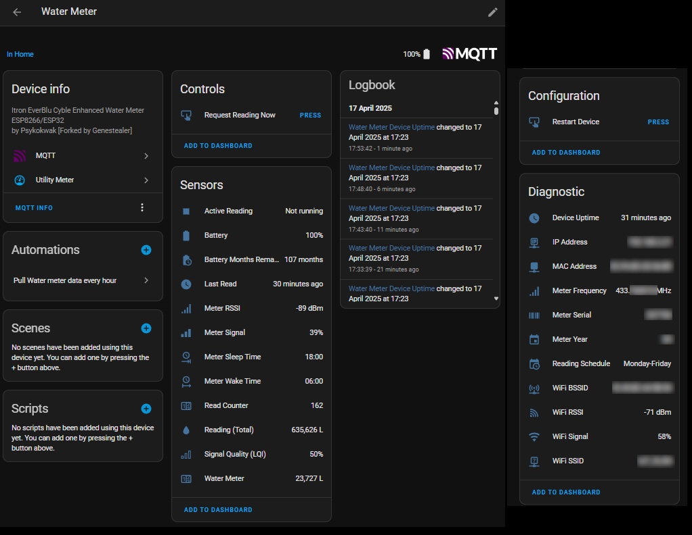
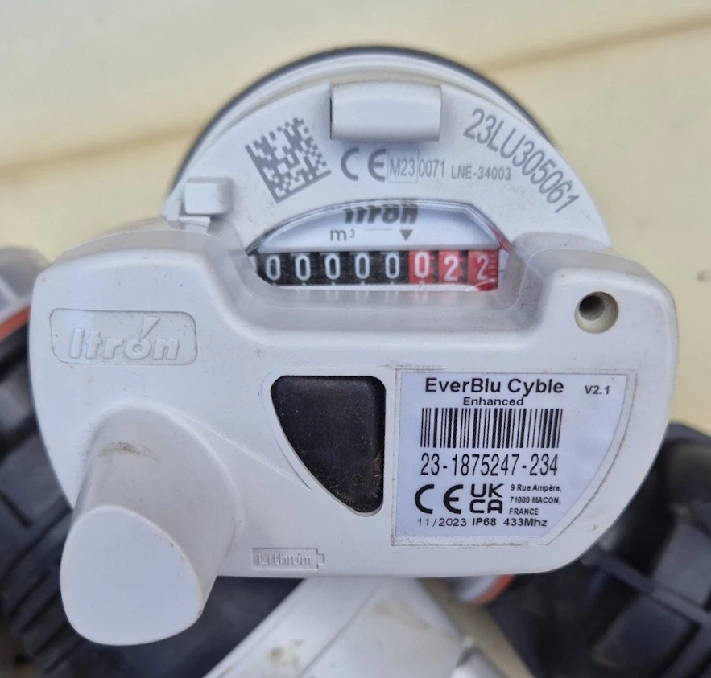

# everblu-meters-esp8266/esp32 - Itron EverBlu Cyble Enhanced RF RADIAN Water/Gas Usage Data for Home Assistant

Fetch water or gas usage data from Itron EverBlu Cyble Enhanced RF meters using the RADIAN protocol (Sontex, Itron) on 433 MHz with an ESP32/ESP8266 and CC1101 transceiver.
Integrated with Home Assistant via MQTT AutoDiscovery.

**Supports both water meters (readings in liters) and gas meters (readings in cubic meters)**.

[](https://github.com/genestealer/everblu-meters-esp8266-improved/actions/workflows/build-esp8266.yml)
[](https://github.com/genestealer/everblu-meters-esp8266-improved/actions/workflows/build-esp32.yml)
[](https://github.com/genestealer/everblu-meters-esp8266-improved/actions/workflows/code-quality.yml)

[](https://platformio.org)
[](https://www.espressif.com/en/products/socs/esp8266)
[](https://www.espressif.com/en/products/socs/esp32)
[](https://en.wikipedia.org/wiki/Wi-Fi)
[](https://arduino-esp8266.readthedocs.io/en/latest/ota_updates/readme.html)
[](https://mqtt.org)
[](https://www.home-assistant.io)
[](LICENSE.md)

Based on regulatory paperwork, this may also work with the following models (untested):

- AnyQuest Cyble Enhanced
- EverBlu Cyble
- AnyQuest Cyble Basic



Supported meters:

- [Itron EverBlu Cyble Enhanced](https://multipartirtaanugra.com/wp-content/uploads/2020/09/09.-Cyble-RF.pdf)



## Features

- Home Assistant integration via MQTT AutoDiscovery.
- Daily scheduled readings (with configurable reading days).
- Built-in frame validation (CRC-16/KERMIT) plus signal diagnostics (RSSI/LQI).
- Automatic CC1101 frequency calibration plus first-boot wide scan.

<details>
<summary>Full feature list</summary>

- Fetch water or gas usage data from Itron EverBlu Cyble Enhanced RF meters.
- **Water meter mode**: Readings in liters (L) with water device class
- **Gas meter mode**: Readings in cubic meters (m³) with gas device class
- Includes RSSI (Radio Signal Strength Indicator), LQI (Link Quality) and Signal Strength for the meter for diagnostics.
- Time Start and Time End sensors to indicate when the meter wakes and sleeps.
- MQTT integration for Home Assistant with AutoDiscovery.
- Automatic CC1101 frequency calibration with manual fallback.
- Wi-Fi diagnostics and OTA updates.
- Built-in CRC-16/KERMIT verification to discard corrupted RADIAN frames before publishing data.
- Reading Schedule Configuration: Configure the days when the meter should be queried (e.g., Monday-Friday, Monday-Saturday, or Monday-Sunday).
- Daily scheduled meter readings.

</details>

## Quick Start: First Successful Reading

### 1. Hardware you need

- ESP8266 (HUZZAH / Wemos D1 Mini) or ESP32 DevKit.
- CC1101 433 MHz RF module (3.3V only).
- USB cable and jumper wires.

See the Hardware section below for full wiring tables and pictures.

### 2. Files you must edit

- `include/private.h` (copy from `include/private.example.h`):
  - Wi‑Fi SSID/password
  - MQTT broker/port (+ credentials, if used)
  - `METER_YEAR` and `METER_SERIAL` (from the meter label)
  - `METER_TYPE` - set to `"water"` (default) or `"gas"` depending on your meter type
  - `MAX_RETRIES` - maximum reading retry attempts before cooldown (optional, default is 10)
  - `WIFI_SERIAL_MONITOR_ENABLED` - set to `1` to enable WiFi serial monitor for remote debugging (default is `0` for security)
- `platformio.ini`: select `env:huzzah` (ESP8266 HUZZAH) or `env:esp32dev` (ESP32 DevKit).

### Meter Type Configuration

This project supports both **water meters** and **gas meters**. The main differences are:

| Meter Type | Unit of Measurement | Device Class | Icon |
|------------|---------------------|--------------|------|
| **Water** (default) | Liters (L) | `water` | `mdi:water` |
| **Gas** | Cubic meters (m³) | `gas` | `mdi:meter-gas` |

To configure your meter type, set `METER_TYPE` in `include/private.h`:
```cpp
#define METER_TYPE "water"  // For water meters
// OR
#define METER_TYPE "gas"    // For gas meters
```

#### Gas Meter Volume Divisor

For gas meters, this firmware assumes an internal count in liter-equivalents and converts those values to cubic meters (m³) before publishing to Home Assistant. If your gas meter uses a different base unit or scaling, you may need to adjust the meter configuration or conversion logic accordingly.

The conversion uses a configurable **gas volume divisor** that can be set in `include/private.h`:
```cpp
// Default: 100 (equivalent to 0.01 m³ per unit)
#define GAS_VOLUME_DIVISOR 100
```

**Important:** The correct divisor depends on your meter's pulse weight configuration:
- `100`: 0.01 m³ per unit (typical for modern EverBlu Cyble gas modules)
- `1000`: 0.001 m³ per unit (0.1 L per unit, less common)

##### How We Determined the Correct Divisor

Through empirical testing with an actual EverBlu Cyble gas meter, we discovered that many gas modules are configured with a pulse weight of **0.01 m³ per unit**, not the 0.001 m³ that might be expected from a naive "liters to cubic meters" conversion.

**Real-world example:**
- Physical meter register: 825,292 m³
- RADIAN protocol data (raw value): 0x00013E07 = 81,415 units
- Using divisor 1000: 81.415 m³ (incorrect, off by ~744 m³)
- Using divisor 100: 814.15 m³ (correct, ~11 m³ gap from register)

The gap of ~11 m³ is consistent with the assumption that the EverBlu module was installed after the meter had already recorded some consumption. Without access to the meter's installation records or multiple data points, we cannot definitively confirm the exact pulse weight; however, **0.01 m³/unit proved more plausible through trial and error comparison with the actual mechanical meter register**.

**If your readings seem incorrect:** Verify your specific meter's pulse weight (often printed on the device label) and adjust `GAS_VOLUME_DIVISOR` accordingly.

### 3. Build and upload the firmware

#### First-time USB Upload

1. Wire the CC1101 to your board as shown in the Hardware section.
2. Connect the board to your computer via USB.
3. Open the project folder in VS Code with PlatformIO installed.
4. **Select your board environment** using the PlatformIO status bar at the bottom:
   - For **Adafruit HUZZAH ESP8266**: select `env:huzzah`
   - For **WeMos D1 Mini**: select `env:d1_mini`
   - For **WeMos D1 Mini Pro**: select `env:d1_mini_pro`
   - For **NodeMCU v2**: select `env:nodemcuv2`
   - For **ESP32 DevKit**: select `env:esp32dev`
5. Click the **PlatformIO: Upload and Monitor** button (→ with line) in the status bar, or use the PlatformIO sidebar:
   - Click the PlatformIO icon on the left sidebar
   - Expand your environment (e.g., "huzzah")
   - Click "Upload and Monitor"
6. Wait for the build and upload to complete.
7. On first boot, wait up to ~2 minutes while the automatic wide frequency scan runs (serial monitor will show progress).
8. Once the scan finishes, you should see meter data in the serial monitor and MQTT topics `everblu/cyble/{METER_SERIAL}/...` on your broker/Home Assistant.

#### Over-The-Air (OTA) Updates

Once your device is running and connected to Wi-Fi, you can update it wirelessly:

1. In `platformio.ini`, find your board's `-ota` environment (e.g., `[env:huzzah-ota]`).
2. **Update the IP address** to match your device's IP:
   ```ini
   upload_port = 192.168.2.21  ; Change to your device's IP
   monitor_port = socket://192.168.2.21:23  ; Change to match upload_port
   ```
3. **Select the OTA environment** in PlatformIO:
   - For **HUZZAH**: select `env:huzzah-ota`
   - For **D1 Mini**: select `env:d1_mini-ota`
   - For **D1 Mini Pro**: select `env:d1_mini_pro-ota`
   - For **NodeMCU v2**: select `env:nodemcuv2-ota`
   - For **ESP32 DevKit**: select `env:esp32dev-ota`
4. Click **PlatformIO: Upload and Monitor** as before.
5. The firmware will be uploaded over your Wi-Fi network.

> **Note**: You can find your device's IP address in the serial monitor output at startup, or check your router's DHCP client list, or look at the `everblu/cyble/{METER_SERIAL}/wifi_ip` MQTT topic in Home Assistant.

---

## Hardware

Runs on ESP8266/ESP32 with a CC1101 RF transceiver. Any ESP8266/ESP32 + CC1101 combo works with the correct wiring.


### Connections (ESP32/ESP8266 to CC1101)

The project uses the ESP8266/ESP32's **hardware SPI pins** to communicate with the CC1101 radio module.
Below are the wiring diagrams for common ESP8266 boards and ESP32 DevKit.

#### Pin Mapping Reference

**For ESP8266 (All Boards):**

- **SCK (SPI Clock)**: GPIO 14
- **MISO (Master In Slave Out)**: GPIO 12
- **MOSI (Master Out Slave In)**: GPIO 13
- **CS/SS (Chip Select)**: GPIO 15
- **GDO0 (CC1101 Data Ready)**: GPIO 5 (configurable in `private.h`)

#### Important Notes

- **Voltage:** The CC1101 operates at **3.3V only**. Do not connect to 5V or you will damage the module.
- **Hardware SPI:** This project uses the ESP8266/ESP32's hardware SPI interface for reliable, high-speed communication.
- **GDO0 Pin:** Default is GPIO 5 for ESP8266, GPIO 4 for ESP32. You can change this in your `private.h` file if needed.

#### Wiring Table

Pin wiring for the [Wemos D1 Mini](https://www.wemos.cc/en/latest/d1/index.html), [Adafruit Feather HUZZAH ESP8266](https://learn.adafruit.com/adafruit-feather-huzzah-esp8266/pinouts), and ESP32 DevKit:

| **CC1101 Pin** | **Function** | **ESP8266 GPIO** | **Wemos D1 Mini** | **HUZZAH ESP8266** | **ESP32 GPIO** | **ESP32 DevKit** | **Notes** |
|----------------|--------------|------------------|-------------------|--------------------|----------------|------------------|-----------|
| **VCC**        | Power        | 3.3V             | 3V3               | 3V                 | 3.3V           | 3V3              | **Important:** Use 3.3V only! |
| **GND**        | Ground       | GND              | G                 | GND                | GND            | GND              | Common ground |
| **SCK**        | SPI Clock    | GPIO 14          | D5                | #14                | GPIO 18        | SCK              | Hardware SPI clock |
| **MISO**       | SPI Data In  | GPIO 12          | D6                | #12                | GPIO 19        | MISO             | Also labeled as GDO1 on some CC1101 modules |
| **MOSI**       | SPI Data Out | GPIO 13          | D7                | #13                | GPIO 23        | MOSI             | Hardware SPI MOSI |
| **CSN/CS**     | Chip Select  | GPIO 15          | D8                | #15                | GPIO 5         | SS               | SPI chip select |
| **GDO0**       | Data Ready   | GPIO 5           | D1                | #5                 | GPIO 4         | GPIO 4           | Digital interrupt pin (configurable in `private.h`) |
| **GDO2**       | Not used     | -                | -                 | -                  | -              | -                | Leave disconnected (optional) |

<details>
<summary>Wiring notes and board-specific quick references (optional)</summary>

#### Regulatory Notes

The EU declaration of conformity for the Cyble RF family (Cyble NRF, Cyble NRF HT, Cyble OMS wM-Bus 434) specifies operation in the 434 MHz ISM band with ≤ 10 mW radiated power.
The CC1101 settings used in this project stay within that envelope, but ensure your antenna choice and deployment follow local regulations.

#### Quick Reference: Wemos D1 Mini

```text
CC1101 → Wemos D1 Mini
VCC    → 3V3
GND    → G
SCK    → D5 (GPIO 14)
MISO   → D6 (GPIO 12)
MOSI   → D7 (GPIO 13)
CSN    → D8 (GPIO 15)
GDO0   → D1 (GPIO 5)
```text

#### Quick Reference: Adafruit Feather HUZZAH ESP8266

```text
CC1101 → HUZZAH ESP8266
VCC    → 3V
GND    → GND
SCK    → #14 (GPIO 14)
MISO   → #12 (GPIO 12)
MOSI   → #13 (GPIO 13)
CSN    → #15 (GPIO 15)
GDO0   → #5  (GPIO 5)
```text

#### Quick Reference: ESP32 DevKit (esp32dev)

```text
CC1101 → ESP32 DevKit
VCC    → 3V3
GND    → GND
SCK    → SCK (GPIO 18 on most DevKit boards)
MISO   → MISO (GPIO 19)
MOSI   → MOSI (GPIO 23)
CSN    → SS (GPIO 5 by default on many boards)
GDO0   → GPIO 4 (or GPIO 27)  ← set this in include/private.h as GDO0
```text

Notes for ESP32
- Use the board’s hardware SPI pins (SCK/MISO/MOSI/SS).
The defaults are provided by the Arduino core and used automatically by this project.
- Choose a free GPIO for GDO0 (e.g., 4 or 27) and set `#define GDO0 <pin>` in `include/private.h`.
- Power the CC1101 from 3.3V only.

#### Adafruit Feather HUZZAH Silkscreen Labels

To make wiring dead-simple on the HUZZAH, here’s the exact silkscreen text next to each pin we use and what it connects to on the CC1101:

- Power
  - Board label: "3V" → CC1101 VCC (3.3V only)
  - Board label: "GND" → CC1101 GND

- SPI signals
  - Board label: "SCK / #14" → CC1101 SCK (SPI Clock)
  - Board label: "MISO / #12" → CC1101 MISO
  - Board label: "MOSI / #13" → CC1101 MOSI
  - Board label: "SS / #15"   → CC1101 CSN (Chip Select)

- CC1101 interrupt (data ready)
  - Board label: "#5" → CC1101 GDO0  (default; configurable via `private.h`)

Notes
- On the HUZZAH, many pins show both the function and the GPIO number, e.g. "SCK / #14".
You can use either reference when wiring.
- Only use the 3V (3.3V) pin to power the CC1101. Do not use 5V.

#### HUZZAH Boot-Strap Pins and Red LED (GPIO #0)

On the Adafruit Feather HUZZAH ESP8266, **GPIO #0 has a red LED attached and is also a boot-strap pin** used to enter the ROM bootloader.
Important implications:

- If GPIO #0 is held LOW during reset/power-up, the ESP8266 will enter the bootloader instead of running your sketch.
- The red LED on GPIO #0 is wired “reverse”: writing LOW turns the LED ON, writing HIGH turns it OFF.
- GPIO #0 does not have an internal pull-up by default.

Because of the above, **do not use GPIO #0 for CC1101 GDO0**.
This project defaults to using **GPIO #5** for GDO0 on HUZZAH, which is safe and avoids accidental bootloader entry.
You can still use GPIO #0 for simple LED indication in your own code, but avoid wiring CC1101 signals to it.

Also note other ESP8266 boot-strap pins on HUZZAH:
- GPIO #15 (used here as CS/SS) must be LOW at boot (the HUZZAH board provides the correct pull-down).
Don’t force it HIGH during reset.
- GPIO #2 should normally be HIGH at boot (not used by this project).

### CC1101

Some modules are not labeled on the PCB. Below is the pinout for one:


</details>

---

## MQTT Integration

Home Assistant integration is provided via MQTT AutoDiscovery.

<details>
<summary>MQTT topics</summary>

The following MQTT topics are used to integrate the device with Home Assistant via AutoDiscovery:

| **Sensor**          | **MQTT Topic**                  | **Description**                                                                |
|---------------------|---------------------------------|--------------------------------------------------------------------------------|
| `Liters`            | `everblu/cyble/liters`          | Total water usage in liters.
|
| `Battery`           | `everblu/cyble/battery`         | Remaining battery life in months.
|
| `Counter`           | `everblu/cyble/counter`         | Number of times the meter has been read (wraps around 255→1).
|
| `RSSI`              | `everblu/cyble/rssi`            | Raw RSSI value of the meter's signal.
|
| `RSSI (dBm)`        | `everblu/cyble/rssi_dbm`        | RSSI value converted to dBm.
|
| `RSSI (%)`          | `everblu/cyble/rssi_percentage` | RSSI value converted to a percentage.
|
| `Time Start`        | `everblu/cyble/time_start`      | Time when the meter wakes up, formatted as `HH:MM`.
|
| `Time End`          | `everblu/cyble/time_end`        | Time when the meter goes to sleep, formatted as `HH:MM`.
|
| `Timestamp`         | `everblu/cyble/timestamp`       | ISO 8601 timestamp of the last reading.
|
| `Wi-Fi IP`          | `everblu/cyble/wifi_ip`         | IP address of the device.
|
| `Wi-Fi RSSI`        | `everblu/cyble/wifi_rssi`       | Wi-Fi signal strength in dBm.
|
| `Wi-Fi Signal (%)`  | `everblu/cyble/wifi_signal_percentage` | Wi-Fi signal strength as a percentage.
|
| `MAC Address`       | `everblu/cyble/mac_address`     | MAC address of the device.
|
| `SSID`              | `everblu/cyble/ssid`            | Wi-Fi SSID the device is connected to.
|
| `BSSID`             | `everblu/cyble/bssid`           | Wi-Fi BSSID the device is connected to.
|
| `Uptime`            | `everblu/cyble/uptime`          | Device uptime in ISO 8601 format.
|

</details>

---

## Multiple Devices

When running multiple ESP devices on the same MQTT broker, the firmware automatically appends the meter serial number to the MQTT Client ID to ensure uniqueness. This prevents connection conflicts and proper Home Assistant availability tracking.

**Example:** With `SECRET_MQTT_CLIENT_ID = "EverblueCyble"` and `METER_SERIAL = 123456`, the final Client ID becomes `"EverblueCyble-123456"`.

---

## Configuration

### Local Development Setup

1. **Install Required Tools**
  - Download and install [Visual Studio Code](https://code.visualstudio.com/).
- Install the [PlatformIO extension for VS Code](https://platformio.org/).
This will install all required dependencies and may require restarting VS Code.

2. **Prepare Configuration Files**
  - Copy `include/private.example.h` to `include/private.h`.
  - Update the following details in `private.h`:
- Wi-Fi and MQTT credentials.
If your MQTT setup does not require a username and password, comment out those lines using `//`.
    - **Meter Serial Number** - Find the serial on your meter label (ignore the manufacturing date):
      - Format: `XX-YYYYYYY-ZZZ` (e.g., "23-1875247-234")
      - Use **first part** for `METER_YEAR` (e.g., 23)
      - Use **middle part** for `METER_SERIAL` (e.g., 1875247)
      - **Ignore the last part** (e.g., ignore -234)
      - **If middle part starts with 0**, omit leading zeros (e.g., "23-0123456-234" → use 123456)

      Example:
      ```cpp
      // Serial on meter: 23-1875247-234
      #define METER_YEAR 23       // First part
      #define METER_SERIAL 1875247 // Middle part only

      // Serial with leading zeros: 23-0123456-234
      #define METER_YEAR 23       // First part
      #define METER_SERIAL 123456  // Omit leading zeros
```text
     
- **Wi-Fi PHY Mode**: To enable 802.11g Wi-Fi PHY mode, set `ENABLE_WIFI_PHY_MODE_11G` to `1` in the `private.h` file.
By default, it is set to `0` (disabled).
    - Radio debug: control verbose CC1101/RADIAN debug output with `DEBUG_CC1101` in `private.h`.
      - `#define DEBUG_CC1101 1` enables verbose radio debugging (default in the example file).
      - `#define DEBUG_CC1101 0` disables verbose radio debugging.

3. **Select Your Board Environment**
  - Use the PlatformIO status bar at the bottom of VS Code to select your board:
    - `env:huzzah` - Adafruit HUZZAH ESP8266 (USB upload)
    - `env:huzzah-ota` - Adafruit HUZZAH ESP8266 (OTA upload)
    - `env:d1_mini` - WeMos D1 Mini (USB upload)
    - `env:d1_mini-ota` - WeMos D1 Mini (OTA upload)
    - `env:d1_mini_pro` - WeMos D1 Mini Pro (USB upload)
    - `env:d1_mini_pro-ota` - WeMos D1 Mini Pro (OTA upload)
    - `env:nodemcuv2` - NodeMCU v2 (USB upload)
    - `env:nodemcuv2-ota` - NodeMCU v2 (OTA upload)
    - `env:esp32dev` - ESP32 DevKit (USB upload)
    - `env:esp32dev-ota` - ESP32 DevKit (OTA upload)
  - **For first-time setup**: Use the standard environment (without `-ota`)
  - **For OTA updates**: After your device is running on Wi-Fi, use the `-ota` environment and update the IP address in `platformio.ini`
  - See the "Quick Start" section above for detailed build and upload instructions

4. **Perform Frequency Discovery (First-Time Setup)**
- On the very first boot (or anytime there is no stored frequency offset), the firmware automatically launches a wide scan while `AUTO_SCAN_ENABLED` is set to `1` (default).
- If you need to skip the scan during development (for example, when you already know the meter's frequency), add `#define AUTO_SCAN_ENABLED 0` to your `include/private.h`.
  - Compile and upload the code to your ESP device using PlatformIO. Use **PlatformIO > Upload and Monitor**.
- **Keep the device connected to your computer during this process.** The serial monitor will display debug output as the device scans frequencies in the 433 MHz range.
- **Important**: During the initial scan (first boot with no stored frequency offset), the device performs a wide frequency scan that takes approximately 2 minutes **before** connecting to MQTT.
You will see no MQTT/Home Assistant activity during this time - this is normal.
Monitor the serial output to see the scan progress.
Once the scan completes and the optimal frequency is found, the device will connect to MQTT and publish telemetry data.
- Once the correct frequency is identified, update the `FREQUENCY` value in `private.h` if needed (the automatic scan stores the offset, so manual adjustment is usually not required).
- To re-run the wide scan later, either set `CLEAR_EEPROM_ON_BOOT` to `1` for a single boot cycle or re-enable `AUTO_SCAN_ENABLED`.
- For best results, perform this step during local business hours when the meter is most likely to transmit.
Refer to the "Frequency Adjustment" section below for additional guidance.

5. **Build and Upload**
  - Follow the build and upload instructions in the "Quick Start" section above.
  - For first-time setup, use USB upload with the standard environment (e.g., `env:huzzah`).
  - Keep the device connected to your computer during USB upload.

6. **Verify Meter Data**
- After WiFi and MQTT connection is established (or after the initial frequency scan completes), the meter data should appear in the terminal (bottom panel) and be pushed to MQTT.
  - If Frequency Discovery is still enabled, its output will also be displayed during this step.
- **Note**: On first boot with no stored frequency offset, there will be a ~2 minute delay before any MQTT activity while the wide frequency scan runs.
This is normal - monitor the serial output to see progress.

7. **Automatic Meter Query**
- The device will automatically query the meter once every 24 hours.
If the query fails, it will retry every hour until successful.

<details>
<summary>Continuous Integration (for contributors)</summary>

This project uses GitHub Actions for automated building, testing, and code quality checks.
Every push and pull request triggers builds and quality checks to ensure code quality and compatibility.

The CI workflows include:
- **Build Workflows**: Builds the project for both ESP8266 (huzzah) and ESP32 (esp32dev) platforms to validate that the code compiles successfully
- **Code Quality**: Runs static analysis using cppcheck and formatting checks with clang-format to identify potential issues and maintain code consistency
- **Dependency Caching**: Caches dependencies for faster builds
- **Artifact Upload**: Uploads firmware artifacts and quality reports for successful builds

You can view the build and quality status at the top of this README or in the [Actions tab](https://github.com/genestealer/everblu-meters-esp8266-improved/actions).

</details>

---

### Reading Schedule

The **Reading Schedule** feature allows you to configure the days when the meter should be queried.
By default, the schedule is set to `Monday-Friday`.
You can change this in the `private.h` file by modifying the `DEFAULT_READING_SCHEDULE`.

Available options:
- `"Monday-Friday"`: Queries the meter only on weekdays.
- `"Monday-Saturday"`: Queries the meter from Monday to Saturday.
- `"Monday-Sunday"`: Queries the meter every day.

Example configuration in `private.h`:
```cpp
#define DEFAULT_READING_SCHEDULE "Monday-Saturday"

```text

### Time zone offset and wake-up window (simple)

Meters often have a local wake window (Time Start/End). The firmware keeps its clock in UTC and applies a simple offset:

Configuration (in `include/private.h`):

```cpp
// Minutes from UTC. Examples: 0 (UTC), 60 (UTC+1), -300 (UTC-5)
#define TIMEZONE_OFFSET_MINUTES 0

```text

Behavior:

- The device schedules reads using UTC+offset (your local time). The default read time is 10:00 (local by offset).
- Auto-align can shift the read hour to the meter's wake window (midpoint by default) in local-offset time; the UTC publish is derived from that.

MQTT topics exposed:

- `everblu/cyble/reading_time` – scheduled time in UTC (HH:MM)

In serial logs at startup you’ll see:

- The UTC time pulled from the time server
- The configured offset (minutes)
- The local (UTC+offset) time

---

### Radio and frequency (advanced)

Most users can skip this section: the firmware auto-calibrates, and on first boot it runs a wide scan if no frequency offset is stored.

<details>
<summary>Frequency configuration and adaptive tracking</summary>

### Frequency Configuration

The firmware auto-calibrates the CC1101 frequency. The base frequency is configured at compile time in `private.h`.

#### How it works

1. **Base frequency**: Set with `FREQUENCY` in `private.h` (e.g., `#define FREQUENCY 433.82`).
2.
**Default**: If `FREQUENCY` is not defined, it defaults to **433.82 MHz** (RADIAN center frequency for EverBlu).
A warning is logged.
3.
**Calibration**: CC1101 synthesizer calibration runs automatically; the firmware also triggers a manual calibration during init.
4. **FOC**: Frequency Offset Compensation is enabled to handle small drift during reception.
5. **Not published to MQTT**: It’s a low-level setting and already visible in the serial startup log.

#### Example

```cpp
// Optional: base frequency in MHz
// If not defined, defaults to 433.82 MHz
#define FREQUENCY 433.82

```text

Ways to find the best frequency:

1. Let the first-boot wide scan run (default).
2. Measure with an RTL-SDR while a utility reader is polling the meter.
3. Start with 433.82 MHz and adjust slightly if needed (often ±0.01 MHz).

The effective frequency is printed at startup:

```text
> Frequency (effective): 433.820000 MHz
```text

---

### Adaptive Frequency Management

To handle CC1101 crystal tolerance, the firmware can adapt over time:

1. **Wide scan (first boot)**: If no offset is stored, scans ±100 kHz around the base frequency (~1–2 minutes).
2.
**Tracking**: After successful reads, averages frequency error and updates the stored offset when it’s consistently off.
3. **FOC tuned**: CC1101 FOC is configured for EverBlu/RADIAN frames.

#### When to clear EEPROM

Clear EEPROM when you change hardware or meter:

- Replace the ESP8266/ESP32
- Replace the CC1101 module
- Move to a different meter

In `include/private.h`, set:

```cpp
#define CLEAR_EEPROM_ON_BOOT 1

```text

Upload, let it boot once (wide scan runs), then set it back to:

```cpp
#define CLEAR_EEPROM_ON_BOOT 0

```text

See `ADAPTIVE_FREQUENCY_FEATURES.md` for deeper technical notes.

</details>

---

## Troubleshooting

### ESP32 build: ModuleNotFoundError: No module named 'intelhex'

This is a PlatformIO tooling dependency used by `esptool.py` to build ESP32 bootloader/partition images.
It is not a project file and isn’t committed to the repo.
PlatformIO usually manages it automatically, but on some Windows setups it can be missing.

Try the following in order:

- Upgrade PlatformIO core and the Espressif32 platform (from PlatformIO Home → Platforms → Updates), or using the PIO terminal:

  ```powershell
  & "$env:USERPROFILE\.platformio\penv\Scripts\platformio.exe" upgrade
  & "$env:USERPROFILE\.platformio\penv\Scripts\platformio.exe" platform update espressif32
```text

- If it still fails, install the package into PlatformIO’s embedded Python (use the PlatformIO terminal to ensure the right interpreter is used):

  ```powershell
& "$env:USERPROFILE\.platformio\penv\Scripts\python.exe" -m pip install --disable-pip-version-check --no-warn-script-location intelhex
```text

Notes

- Only ESP32 builds use this dependency; ESP8266 builds do not require `intelhex`.
- Prefer the PlatformIO terminal over a global Python to avoid installing into the wrong environment.

### ESP32 compile errors about ESP8266 headers

The code now conditionally includes headers based on the target (ESP8266 vs ESP32).
If you still see includes like `ESP8266WiFi.h` during an ESP32 build, ensure you selected the `esp32dev` environment and not an ESP8266 one.

### Frequency Adjustment

Your transceiver module may not be calibrated correctly.
Adjust the frequency slightly lower or higher and try again.
You may use an RTL-SDR to measure the required offset and rerun the Frequency Discovery code.

### Business Hours

> [!TIP]
> Your meter may be configured to listen for requests only during business hours to conserve energy.
If you are unable to communicate with the meter, try again during business hours (8:00–16:00), Monday to Friday.
As a rule of thumb, set up your device during business hours to avoid confusion and unnecessary troubleshooting.

> [!NOTE]
> This is particularly relevant in the UK.

### Serial Number Starting with 0

Ignore the leading 0 and provide the serial number in the configuration without it.

### Distance Between Device and Meter

Typically, a CC1101 433 MHz module with an external wire coil antenna has a maximum range of 300–500 m.
SMA CC1101 boards with high-gain antennas may increase or even double this range.
However, be mindful of the distance for effective use.

---

## Credits

This project builds on reverse engineering efforts by:

- La Maison Simon (http://www.lamaisonsimon.fr/)
- @neutrinus and @psykokwak on GitHub

The original software (and much of the foundational work) was initially developed [here](http://www.lamaisonsimon.fr/wiki/doku.php?id=maison2:compteur_d_eau:compteur_d_eau), later published on GitHub by @neutrinus [here](https://github.com/neutrinus/everblu-meters), and subsequently forked by [psykokwak](https://github.com/psykokwak-com/everblu-meters-esp8266).

Their original projects did not include an open-source license.
If you reuse or modify their specific code portions, please review their repositories and respect any stated limitations or intentions.

---

## ⚠️ Legal Notice

**Radio Licensing**: The 433 MHz ISM band is license-exempt in UK/EU for low-power (<10 mW) use under ETSI EN 300-220.

**Communications Law**: Under UK Wireless Telegraphy Act 2006 Section 48, intercepting radio communications not intended for you may be unlawful, even if it's your own meter.
The transmission is technically between the meter and utility.

**Encryption**: Most EverBlu Cyble Enhanced meters transmit unencrypted RADIAN protocol data, making DIY decoding technically feasible.

**Recommendation**: This project is for **personal use on your own property only**.
Consider obtaining utility permission. Never use on meters you don't own. Proceed at your own risk.

📄 **For detailed legal analysis, protocol history, and encryption details, see [LEGAL_NOTICE.md](docs/LEGAL_NOTICE.md)**

### Community Resources

- [Maison Simon Wiki (FR) – RADIAN protocol explained](https://lamaisonsimon.fr/wiki/doku.php?id=eau:sonde_eau_radio)
- [ESP8266/ESP32 + CC1101 decoder](https://github.com/neutrinus/everblu-meters)

---
