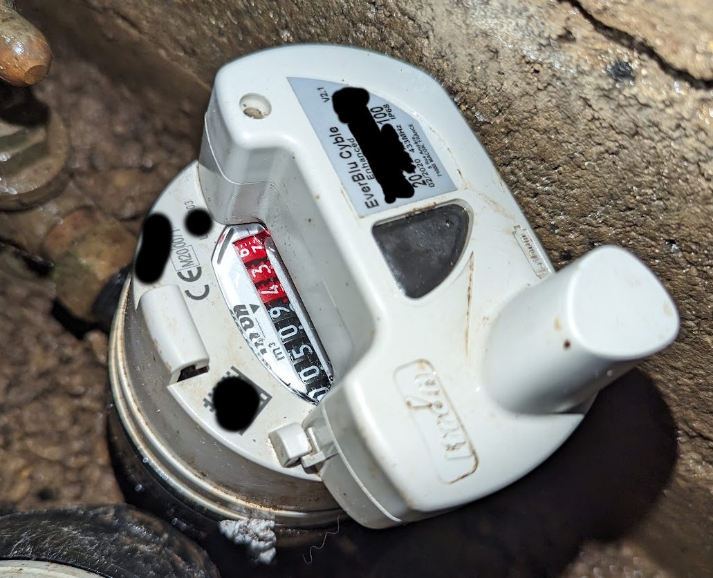
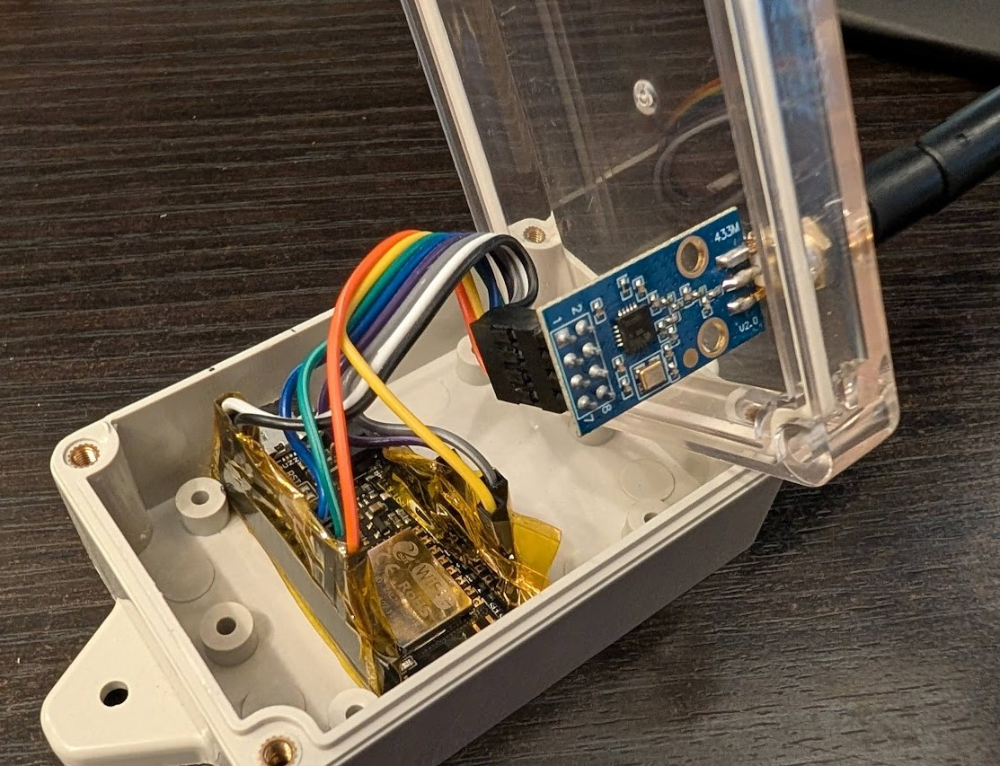

# everblu-meters-esp8266/esp32 - Water usage data for Home Assistant
Fetch water/gas usage data from Itron EverBlu Cyble RF Enhanced water meters using RADIAN protocol on 433Mhz using an ESP32/ESP8266 and CC1101 transceiver. Integrated with Home Assistant via MQTT AutoDiscovery. 


Software original code (but also all the hard work to get things working was originally done [here](http://www.lamaisonsimon.fr/wiki/doku.php?id=maison2:compteur_d_eau:compteur_d_eau) then put on github by @neutrinus [here](https://github.com/neutrinus/everblu-meters) and then forked by [psykokwak](https://github.com/psykokwak-com/everblu-meters-esp8266)

Meters supported:
- [Itron EverBlu Cyble Enhanced](https://multipartirtaanugra.com/wp-content/uploads/2020/09/09.-Cyble-RF.pdf)



## Hardware
The project runs on ESP8266/ESP32 with an RF transreciver (CC1101). Hardware can be any ESP32+CC1101 with correct wiring.



### Connections (ESP32/ESP8266 to CC1101):
- See `cc1101.ccp` for SPI pins mapping.
- See `everblu_meters.h` for GDOx pins mapping.

Pins wiring for [Wemos D1 board](https://www.wemos.cc/en/latest/d1/index.html) and [Adafruit Feather HUZZAH ESP8266](https://learn.adafruit.com/adafruit-feather-huzzah-esp8266/pinouts):

| **CC1101**  | **Wemos** | **HUZZAH ESP8266** | **Notes**                                      |
|-------------|-----------|---------------------------|------------------------------------------------|
| VCC         | 3V3       | 3V                       | Connect to the 3.3V power pin.                |
| GDO0        | D1        | GPIO5                    | General-purpose digital output.               |
| CSN         | D8        | GPIO15                   | SPI chip select; Feather has GPIO15 as CS.    |
| SCK         | D5        | GPIO14                   | SPI clock pin; SPI SCK maps to GPIO14.        |
| MOSI        | D7        | GPIO13                   | SPI MOSI pin; maps to GPIO13 on the Feather.  |
| GDO1 (MISO) | D6        | GPIO12                   | SPI MISO pin; maps to GPIO12 on the Feather.  |
| GDO2        | D2        | GPIO4                    | Another general-purpose digital output.       |
| GND         | G         | GND                      | Connect to ground.                            |

## Configuration 
1. Clone this repo in VSCode
1.1 This should prompt to install dependancies such as PlatformIO, follow the setup process before proceeding (may require a VSCode Restart)
2. copy `Exampleprivate.h` into the src folder, rename to `private.h` 
* Update WiFi and MQTT details in `private.h`. If you do not use username and password for MQTT then comment those out with //
* Set meter serial number (without the leading 0) and production year in `private.h`, it can be found on the meter label itself:
![Cyble Meter Label]
(meter_label.png)(meter_label_21.png)
3 Update platformio.ini to match your specific platform and baord
4 First time setup only: towards the bottom of `everblu-meters-esp8266.cpp` uncomment the Frequency Discovery code snippet to show debug output of your meter's dsicovered frequency value. Once you have this you can update the FREQUENCY value in `private.h` and re-comment out this code. For best results do this process well within your local nominal business working hours. For more information see blow section on Frequency Adjustment. 
5. Compile and flash to your ESP device, keep it connected to your computer 
* Use PlatformIO > Upload and Monitor for the first time frequency Discovery process, use PlatformIO > Upload if you have your frequency info or are just updating the build 
4. After a few seconds your meter data should be on the bottom panel (terminal) and data should be pushed to MQTT. 
* If you have setup the Frequency Discvery you should also see this process being output at this point.
5. The device will query the meter once a day, every 24 hours and retry every hour if query failed.

## Troubleshooting

### Frequency adjustment
Your transreciver module may be not calibrated correctly, please modify frequency a bit lower or higher and try again. You may use RTL-SDR to measure the offset needed.
You can uncomment the part of the code in the `everblu-meters-esp8266.cpp` file that scans all the frequencies around the meter frequency to find the correct one.

```
  /*
  Serial.printf("###### FREQUENCY DISCOVERY ENABLED ######\nStarting Frequency Scan...\n");
  for (float i = 433.76f; i < 433.890f; i += 0.0005f) {
    Serial.printf("Test frequency : %f\n", i);
    cc1101_init(i);
    struct tmeter_data meter_data;
    meter_data = get_meter_data();
    if (meter_data.reads_counter != 0 || meter_data.liters != 0) {
      Serial.printf("\n------------------------------\nGot frequency : %f\n------------------------------\n", i);
      Serial.printf("Liters : %d\nBattery (in months) : %d\nCounter : %d\n\n", meter_data.liters, meter_data.battery_left, meter_data.reads_counter);
      digitalWrite(LED_BUILTIN, LOW); // turned on
      while (42);
    }
  }
    Serial.printf("###### FREQUENCY DISCOVERY FINISHED ######\nOnce you have discovered the correct frequency you can disable this scan.\n\n");
  */
```

### Business hours
Your meter may be configured in such a way that is listens for request only during hours when data collectors work - to conserve energy. If you are unable to communicate with the meter, please try again during business hours (8:00-16:00), Monday to Friday. As a rule of thumb, please try to set up your device only during business hours, then you can avoid confusion and asking questions why is it not working!  

### Serial number starting with 0
Please ignore the leading 0, provide serial in configuration without it.

### Distance between device and meter
Typically a CC1101 433 MHz with external wire coil antenna has a max range of 300-500m, SMA CC1101 boards with high gain antennas may increase or even double this range, but be mindful of the distance for effective use.

## Origin and license

This code is based on code from http://www.lamaisonsimon.fr/wiki/doku.php?id=maison2:compteur_d_eau:compteur_d_eau 

The license is unknown, citing one of the authors (fred):

> I didn't put a license on this code maybe I should, I didn't know much about it in terms of licensing.
> this code was made by "looking" at the radian protocol which is said to be open source earlier in the page, I don't know if that helps?
