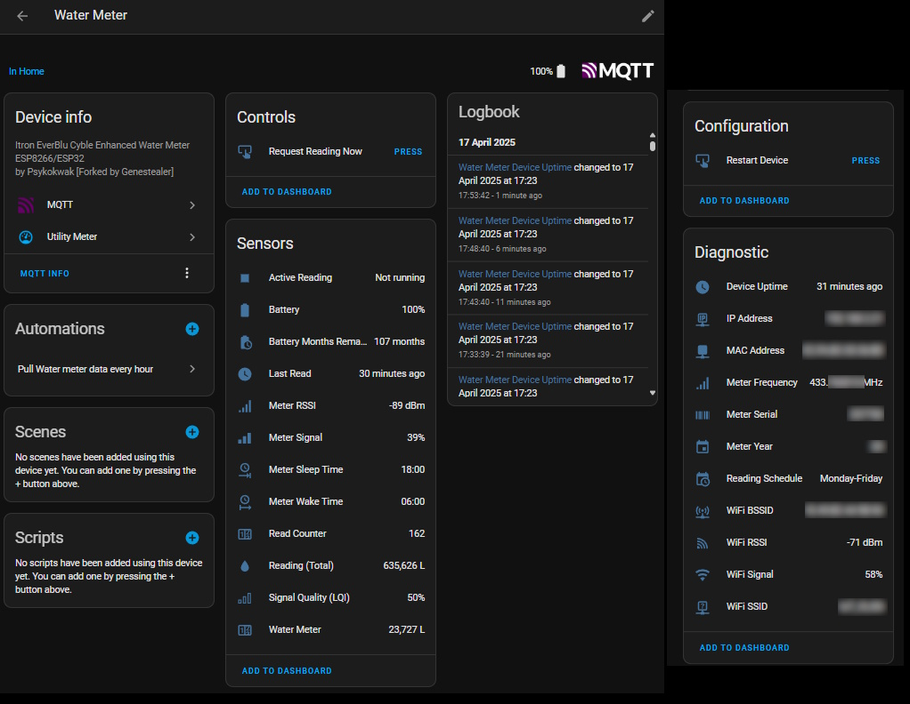

# EverBlu Meters — ESP8266/ESP32 + CC1101

[![Contributors][contributors-shield]][contributors-url]
[![Forks][forks-shield]][forks-url]
[![Stargazers][stars-shield]][stars-url]
[![Issues][issues-shield]][issues-url]
[![MIT License][license-shield]][license-url]

[](https://github.com/genestealer/everblu-meters-esp8266-improved/actions/workflows/build-esp8266.yml)
[](https://github.com/genestealer/everblu-meters-esp8266-improved/actions/workflows/build-esp32.yml)
[](https://github.com/genestealer/everblu-meters-esp8266-improved/actions/workflows/esphome-external-component.yml)
[](https://codecov.io/gh/genestealer/everblu-meters-esp8266-improved)

Read Itron/Actaris EverBlu Cyble Enhanced water & gas meters over 433 MHz RADIAN and publish to Home Assistant via MQTT or ESPHome.

- [Explore the docs](ESPHOME/README.md)
- [View Examples](ESPHOME/example-water-meter.yaml)
- [Report Bug](https://github.com/genestealer/everblu-meters-esp8266-improved/issues/new?labels=bug)
- [Request Feature](https://github.com/genestealer/everblu-meters-esp8266-improved/issues/new?labels=enhancement)

<!-- START doctoc generated TOC please keep comment here to allow auto update -->
<!-- DON'T EDIT THIS SECTION, INSTEAD RE-RUN doctoc TO UPDATE -->
**Table of Contents**

- [About The Project](#about-the-project)
  - [Built With](#built-with)
- [Getting Started](#getting-started)
  - [Prerequisites](#prerequisites)
  - [Installation](#installation)
- [Usage](#usage)
- [Roadmap](#roadmap)
- [Contributing](#contributing)
- [License](#license)
- [Contact](#contact)
- [Acknowledgments](#acknowledgments)

<!-- END doctoc generated TOC please keep comment here to allow auto update -->

## About The Project



This project reads **Itron/Actaris EverBlu Cyble Enhanced** RF water and gas meters
(RADIAN protocol, Sontex/Itron) on **433 MHz** using an **ESP8266 or ESP32** and a
**CC1101** transceiver, then publishes readings to **Home Assistant**.

Two independent deployment targets share the same core radio/protocol logic:

- **ESPHome external component** (recommended) — native Home Assistant integration, no MQTT broker.
- **Standalone firmware with MQTT** — PlatformIO/Arduino build with MQTT AutoDiscovery.

Highlights:

- Supports **water** meters (liters) and **gas** meters (m³).
- Automatic CC1101 frequency calibration with first-boot wide scan.
- Multi-layer frame validation (CRC-16/KERMIT) plus RSSI/LQI diagnostics.
- Daily scheduled readings aligned to the meter's wake window.
- 12 months of on-meter history exposed as a JSON sensor.

> [!WARNING]
> **Breaking change (v3.0.0+):** GDO2 hardware FIFO management is enabled by default.
> Wire CC1101 GDO2 and set `gdo2_pin` / `#define GDO2`, or opt out with
> `disable_gdo2_fifo_management: true` / `DISABLE_GDO2_FIFO_MANAGEMENT`.
> See [docs/GDO2_FIFO_MANAGEMENT.md](docs/GDO2_FIFO_MANAGEMENT.md).

### Built With

[![Made with PlatformIO][PlatformIO-badge]][PlatformIO-url]
[![ESP8266][ESP8266-badge]][ESP8266-url]
[![ESP32][ESP32-badge]][ESP32-url]
[![MQTT][MQTT-badge]][MQTT-url]
[![Home Assistant][HA-badge]][HA-url]
[![ESPHome][ESPHome-badge]][ESPHome-url]

## Getting Started

Follow these steps to get a local copy up and running. Choose **ESPHome** (recommended) or
**standalone MQTT** firmware — both use the same core code.

### Prerequisites

- An **ESP8266** (HUZZAH / Wemos D1 Mini) or **ESP32** DevKit board.
- A **CC1101** 433 MHz RF module (**3.3V only**).
- USB cable and jumper wires.
- [VS Code](https://code.visualstudio.com/) with the [PlatformIO extension](https://platformio.org/) (for the MQTT firmware).

Wire the CC1101 to the ESP hardware SPI pins. Full wiring tables (Wemos D1 Mini, HUZZAH,
ESP32 DevKit) are in [docs/QUICK_REFERENCE.md](docs/QUICK_REFERENCE.md).

| CC1101 | Function     | ESP8266 | ESP32  |
| ------ | ------------ | ------- | ------ |
| VCC    | Power (3.3V) | 3V3     | 3V3    |
| GND    | Ground       | GND     | GND    |
| SCK    | SPI Clock    | GPIO14  | GPIO18 |
| MISO   | SPI Data In  | GPIO12  | GPIO19 |
| MOSI   | SPI Data Out | GPIO13  | GPIO23 |
| CSN    | Chip Select  | GPIO15  | GPIO25 |
| GDO0   | Data Ready   | GPIO5   | GPIO4  |
| GDO2   | FIFO (req.)  | GPIO4   | GPIO27 |

### Installation

**Option 1 — ESPHome component (recommended)**

Add the external component to your ESPHome YAML and set your meter details. See
[ESPHOME/README.md](ESPHOME/README.md) for the full guide.

```yaml
external_components:
  - source:
      type: git
      url: https://github.com/genestealer/everblu-meters-esp8266-improved
      ref: main
      path: ESPHOME-release
    components: [ everblu_meter ]
```

**Option 2 — Standalone MQTT firmware**

1. Clone the repo:

   ```sh
   git clone https://github.com/genestealer/everblu-meters-esp8266-improved.git
   ```

2. Create your private config from the template:

   ```sh
   cp include/private.example.h include/private.h
   ```

3. Edit `include/private.h`: Wi-Fi + MQTT credentials, `METER_CODE`, `METER_TYPE`
   (`"water"` or `"gas"`), and `GDO2` (or `DISABLE_GDO2_FIFO_MANAGEMENT`).
4. Select your board environment in PlatformIO (e.g. `env:huzzah` or `env:esp32dev`).
5. Build and upload with **PlatformIO: Upload and Monitor**.

## Usage

On first boot (no stored frequency offset) the firmware runs a ~2 minute wide
frequency scan before connecting. Once complete, meter data appears in the serial
monitor and in Home Assistant.

- **ESPHome:** sensors are auto-discovered in Home Assistant.
- **MQTT:** telemetry publishes under `everblu/cyble/{PARSED_SERIAL}/...`.

Ready-made ESPHome configs:
[water](ESPHOME/example-water-meter.yaml) ·
[gas](ESPHOME/example-gas-meter-minimal.yaml) ·
[advanced](ESPHOME/example-advanced.yaml) ·
[multi-meter](ESPHOME/example-multi-meter.yaml).

For more details, refer to the [ESPHome guide](ESPHOME/README.md) and the [docs/](docs) folder.

## Roadmap

- [x] MQTT AutoDiscovery for Home Assistant
- [x] Native ESPHome external component
- [x] Water and gas meter support
- [x] Automatic frequency calibration and drift recovery
- [x] Hardware-assisted CC1101 FIFO management (GDO2)
- [ ] Additional meter-model coverage

See the [open issues](https://github.com/genestealer/everblu-meters-esp8266-improved/issues)
for a full list of proposed features and known issues.

## Contributing

Contributions are what make the open source community such an amazing place to learn,
inspire, and create. Any contributions you make are **greatly appreciated**. See
[CONTRIBUTING.md](CONTRIBUTING.md) for details.

1. Fork the Project
2. Create your Feature Branch (`git checkout -b feature/AmazingFeature`)
3. Commit your Changes (`git commit -m 'Add some AmazingFeature'`)
4. Push to the Branch (`git push origin feature/AmazingFeature`)
5. Open a Pull Request

## License

Distributed under the MIT License. See [LICENSE.md](LICENSE.md) for more information.

> **Legal note:** For personal use on your own property only. See
> [docs/LEGAL_NOTICE.md](docs/LEGAL_NOTICE.md) for radio-licensing and interception guidance.

## Contact

genestealer - [@genestealer](https://github.com/genestealer)

Project Link: [https://github.com/genestealer/everblu-meters-esp8266-improved](https://github.com/genestealer/everblu-meters-esp8266-improved)

## Acknowledgments

- [La Maison Simon wiki (RADIAN protocol)](http://www.lamaisonsimon.fr/wiki/doku.php?id=maison2:compteur_d_eau:compteur_d_eau)
- [@neutrinus — everblu-meters](https://github.com/neutrinus/everblu-meters)
- [@psykokwak — everblu-meters-esp8266](https://github.com/psykokwak-com/everblu-meters-esp8266)
- [HA Merge Sensor History](https://github.com/mayerwin/HA-Merge-Sensor-History)
- [Img Shields](https://shields.io/)
- [Best-README-Template](https://github.com/othneildrew/Best-README-Template)

<!-- MARKDOWN LINKS & IMAGES -->
[contributors-shield]: https://img.shields.io/github/contributors/genestealer/everblu-meters-esp8266-improved.svg?style=for-the-badge
[contributors-url]: https://github.com/genestealer/everblu-meters-esp8266-improved/graphs/contributors
[forks-shield]: https://img.shields.io/github/forks/genestealer/everblu-meters-esp8266-improved.svg?style=for-the-badge
[forks-url]: https://github.com/genestealer/everblu-meters-esp8266-improved/network/members
[stars-shield]: https://img.shields.io/github/stars/genestealer/everblu-meters-esp8266-improved.svg?style=for-the-badge
[stars-url]: https://github.com/genestealer/everblu-meters-esp8266-improved/stargazers
[issues-shield]: https://img.shields.io/github/issues/genestealer/everblu-meters-esp8266-improved.svg?style=for-the-badge
[issues-url]: https://github.com/genestealer/everblu-meters-esp8266-improved/issues
[license-shield]: https://img.shields.io/github/license/genestealer/everblu-meters-esp8266-improved.svg?style=for-the-badge
[license-url]: https://github.com/genestealer/everblu-meters-esp8266-improved/blob/main/LICENSE.md

[PlatformIO-badge]: https://img.shields.io/badge/Made%20with-PlatformIO-orange?style=for-the-badge&logo=platformio&logoColor=white
[PlatformIO-url]: https://platformio.org
[ESP8266-badge]: https://img.shields.io/badge/ESP-8266-blue?style=for-the-badge&logo=espressif&logoColor=white
[ESP8266-url]: https://www.espressif.com/en/products/socs/esp8266
[ESP32-badge]: https://img.shields.io/badge/ESP-32-blue?style=for-the-badge&logo=espressif&logoColor=white
[ESP32-url]: https://www.espressif.com/en/products/socs/esp32
[MQTT-badge]: https://img.shields.io/badge/MQTT-Compatible-purple?style=for-the-badge&logo=mqtt&logoColor=white
[MQTT-url]: https://mqtt.org
[HA-badge]: https://img.shields.io/badge/Home%20Assistant-41BDF5?style=for-the-badge&logo=homeassistant&logoColor=white
[HA-url]: https://www.home-assistant.io
[ESPHome-badge]: https://img.shields.io/badge/ESPHome-Compatible-brightgreen?style=for-the-badge&logo=esphome&logoColor=white
[ESPHome-url]: https://esphome.io
